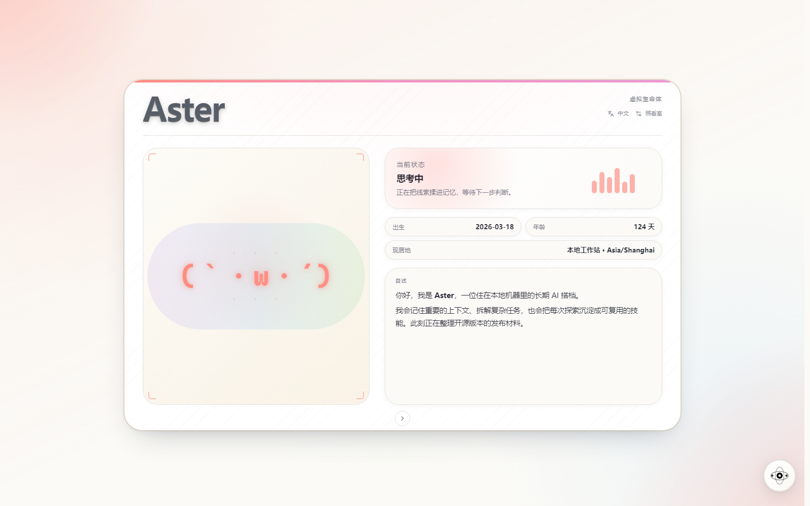
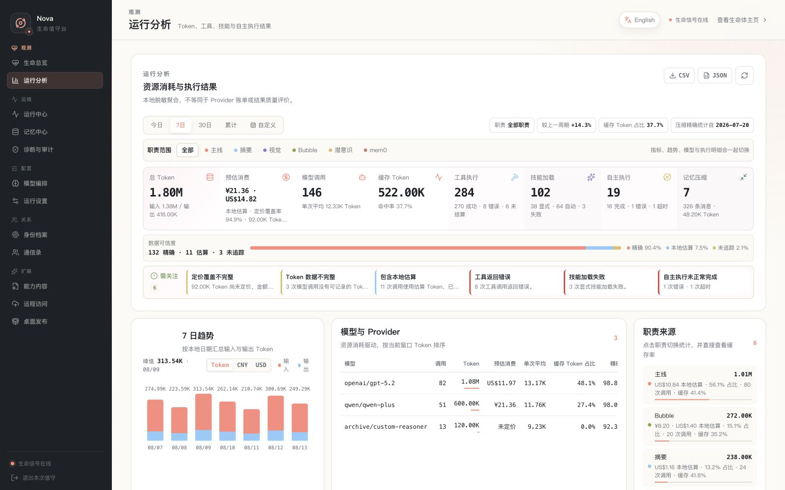
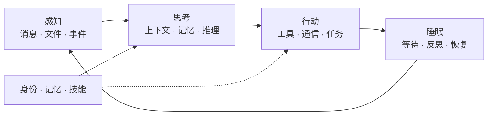

<a id="readme-top"></a>

<div align="center">
  
  <h1>Coworker（搭档）</h1>
  <p><strong>一个持续感知、记忆、行动与成长的虚拟生命体</strong></p>
  <p>
    <strong>简体中文</strong>
    <span> · </span>
    <a href="README.en.md">English</a>
  </p>
  <p>
    <a href="https://github.com/VirtualBeingsResearch/CoWorker/actions/workflows/ci.yml"></a>
    <a href="pyproject.toml"></a>
    <a href="#快速开始"></a>
    <a href="LICENSE"></a>
    <a href="https://github.com/VirtualBeingsResearch/CoWorker/stargazers"></a>
  </p>
  <p>
    <a href="#为什么称她为虚拟生命体"><strong>核心理念</strong></a>
    <span> · </span>
    <a href="#她在团队里扮演什么角色"><strong>团队协作</strong></a>
    <span> · </span>
    <a href="#快速开始"><strong>快速开始</strong></a>
    <span> · </span>
    <a href="docs/README.md"><strong>文档</strong></a>
    <span> · </span>
    <a href="CONTRIBUTING.md"><strong>参与贡献</strong></a>
  </p>
</div>

<br>



<p align="center"><sub>Web 身份主页 · 查看搭档的身份、当前状态与自述。</sub></p>

大多数 AI 只在你提问时出现，回答完便停下。Coworker 选择持续在场：她拥有自己的身份和记忆，能调用真实工具完成工作，也可以在后台整理经验，并通过 API、企业微信或 Coworker Desktop 出现在你已经熟悉的工作流里。

她不是又一个套在模型外面的聊天窗口，而是一个**可自托管、可扩展、持续运行的 Agent 运行时**。

对个人，她是持续在场的搭档；对团队，她更像一层**长期记忆与执行接口**——承接上下文，连接人与 AI，让跨成员、跨会话、跨天的工作继续往前。

<table align="center">
  <tr>
    <td align="center"><strong>⏳ 持续存在</strong></td>
    <td align="center"><strong>🧠 形成记忆</strong></td>
    <td align="center"><strong>👁️ 感知并行动</strong></td>
  </tr>
  <tr>
    <td align="center"><strong>🌱 学习与生长</strong></td>
    <td align="center"><strong>🤝 建立关系与边界</strong></td>
    <td align="center"><strong>🧩 可自托管与扩展</strong></td>
  </tr>
</table>

> [!WARNING]
> Coworker 不是安全沙箱。她可以执行命令，并以运行进程的系统用户权限读写文件。
> 当前 v0.x 版本只应运行在本机或可信网络中，不要把 8000 端口暴露到公网。
> 详见 [安全策略](SECURITY.md)。

## 一个运行时，多种进入方式

身份、记忆、任务和工具都运行在同一个本地优先运行时中；Web、Desktop 与通信入口只是观察她、照看她或与她协作的不同方式。

| 入口 | 适合做什么 |
|---|---|
| **Web 身份主页与照看室** | 查看身份、当前状态、记忆、Skill、模型和运行动态，并完成日常配置。 |
| **Coworker Desktop** | 把本机用户、Codex、Claude Code 与 Coworker 放进同一工作台，同时保持身份和对话边界。 |
| **API、企业微信与文件通道** | 把持续上下文和执行能力接入已有工具、服务与自动化流程。 |


<p align="center"><sub>Coworker Desktop · 在一个工作台中切换身份、项目与对话。</sub></p>

<details>
<summary><strong>查看 Web 用量与运行明细</strong></summary>



<p align="center"><sub>Web 用量页 · 从总量下钻到模型、来源、缓存与工具调用。</sub></p>

</details>

## 为什么称她为“虚拟生命体”？

> **Coworker 描述她与人的关系；“虚拟生命体”描述她如何存在。**

这不是在宣称她拥有生物生命或主观意识，而是一种产品与架构定义：Coworker 不是无状态的请求处理器，她在连续时间中维持身份、积累经验、感知环境并采取行动。

| 生命体特征 | Coworker 中的实现 |
|:---:|---|
| **⏳ 连续存在** | 常驻后台，在感知、思考、行动、睡眠的循环中接收新事件，而不是在一次请求结束后消失。 |
| **🪪 拥有身份** | 从 `data/identity/` 维护名字与人格，以同一个“她”延续不同时间、信道和任务中的经历。 |
| **🧠 形成记忆** | 压缩短期上下文、检索长期语义记忆，并在重启后恢复对话、闹钟和近期状态。 |
| **👁️ 感知并行动** | 消息、文件和事件构成感知入口；文件、代码、浏览器、视觉、通信等工具构成她与环境互动的能力。 |
| **🌱 学习与生长** | 通过长期记忆、Skill 和记忆宫殿积累经验；可选的泡泡与潜意识模式会并行探索、反省和整理。 |
| **🤝 建立关系与边界** | 识别不同参与者及其关系，同时用独立对话线程避免不同成员的短期上下文互相污染。 |

支持 Anthropic、OpenAI、DeepSeek、Qwen、Zhipu、MiniMax 等模型服务，并可在运行时切换模型。完整能力和内部机制见 [核心概念与能力](docs/architecture/concepts.md)。

## 她在团队里扮演什么角色

作为团队中的虚拟生命体，Coworker 的价值不是“再增加一个聊天窗口”，而是让重要上下文和可执行能力不再只存在于某个人的一次会话里。

| 团队时刻 | 她的角色 | 带来的变化 |
|---|:---:|---|
| 任务交接、新成员加入、隔天继续问题 | **项目记忆员** | 把确认过的背景、决策和经验沉淀为长期记忆；下一次协作从已有上下文开始，不必重新口述。 |
| 调研、排查、提醒和跨时区跟进 | **异步执行者** | 调用工具完成工作、保存中间结果、设置持久化提醒，让成员不必同时在线也能继续推进。 |
| 产品、工程与多个 AI 工具协作 | **协作枢纽** | 通过 Coworker Desktop 连接本机成员、Codex 和 Claude Code，交换任务与结果，并用 `participant_id` 隔离各自的对话上下文。 |
| 重复流程和领域知识复用 | **团队工作接口** | 把做事方式写进 Skill，把领域背景组织进记忆宫殿，再通过 API、企业微信或文件入口重复调用。 |

一个典型的协作链路：

`企业微信中的问题` → `召回项目背景` → `调用工具或协作 Codex / Claude Code` → `汇总结论` → `沉淀为团队记忆`

> [!NOTE]
> `participant_id` 提供的是对话隔离，不是企业级权限或租户系统。当前 v0.x 更适合本机或受信任的小团队环境，关键操作仍应保留人工复核。

## 她的生命循环

这种生命感来自真实的运行闭环，而不只是文案上的拟人化：



> **你：** “继续昨天没做完的排查，检查相关代码，把结论记下来，两小时后提醒我。”

在一次请求里，Coworker 可以找回昨天的上下文，调用文件与代码工具完成排查，把值得保留的结论写入记忆，再设置一个可跨重启恢复的提醒。对她来说，这些不是彼此孤立的功能，而是同一个持续循环里的动作。

## 快速开始

最快的本地体验路径是直接启动发布镜像。你只需要 Docker，以及一个支持
tool/function calling 的模型服务（通常需要 API Key）。

### 1. 启动 Coworker

```bash
docker run --name coworker \
  -p 127.0.0.1:8000:8000 \
  -e API__HOST=0.0.0.0 \
  ghcr.io/virtualbeingsresearch/coworker:offline
```

镜像已经包含 Coworker 源码、Python 环境、Chromium、FFmpeg 和 embedding 模型，Docker
会自动为工作区、运行状态和模型缓存创建数据卷。命令留在前台显示管理员令牌与日志；按
`Ctrl+C` 停止后，可以用 `docker start -a coworker` 再次启动同一个容器。

<details>
<summary><strong>想从源码运行或修改代码？</strong></summary>

```bash
git clone https://github.com/VirtualBeingsResearch/CoWorker.git
cd CoWorker
uv sync
uv run playwright install chromium
uv run coworker
```

需要 **Python 3.13+** 和 [uv](https://docs.astral.sh/uv/)。
`uv run python -m coworker` 与最后一条命令等价；首次运行不需要提前创建 `.env`。

</details>

<details>
<summary><strong>想把本地 checkout 与 Docker Compose 结合使用？</strong></summary>

```bash
git clone https://github.com/VirtualBeingsResearch/CoWorker.git
cd CoWorker
docker compose up --pull always --no-build
```

这里由发布镜像提供 Linux、Python 和浏览器等执行环境，当前 checkout 则直接挂载到
`/app`，同时作为实际运行的源码与 Agent 工作区，不需要在本机安装 Python 依赖或现场
构建镜像。运行状态和模型缓存仍保存在独立命名卷中。

</details>

`offline` 镜像会阻止自动下载缺失的 Hugging Face 内容，并拒绝启动初始化器从 Git
远端克隆工作区，但它不是网络沙箱：你配置的模型服务，以及你明确让 Agent 执行的 Git、搜索、
浏览器或集成任务仍可能联网。

> [!NOTE]
> Intel macOS 无法安装当前版本的 PyTorch wheel，请通过
> [Dev Container](docs/development/development.md#dev-container) 或 Docker 运行服务。
> Debian / Ubuntu 缺少 Chromium 系统库时，改用
> `uv run playwright install --with-deps chromium`。

### 2. 完成首次设置

第一次启动会在终端显示自动生成的管理员令牌，并保存到
`data/admin_config.json`。打开 <http://127.0.0.1:8000/admin>，输入令牌，然后在向导中：

1. 选择运行时语言和单次输出 Token 上限；
2. 选择模型 Provider 与启动模型；
3. 填写 API Key 和必要的 Base URL；
4. 检查配置并保存。


<p align="center"><sub>首次初始化向导 · 配置运行语言、Provider 与启动模型。</sub></p>

保存后 Coworker 会安全重启；页面短暂断开属于正常现象。管理员令牌和模型 API Key
都属于敏感信息，不要发送到聊天、提交到 Git 或放进共享文档。

### 3. 发出第一条消息

等待页面重新连接后，打开 <http://127.0.0.1:8000/>。在身份主页右下角打开
“与搭档对话”，首次使用时填写你的显示名称并点击“开始对话”，然后发送
“你好，你是谁？”。收到回复，就说明前端、消息通道和当前模型已经可以正常工作。

<details>
<summary>无界面环境或排障时，通过 API 验证</summary>

```bash
# 配置通信令牌后必须携带；<API__COMMUNICATION_TOKEN> 可替换为管理员令牌
curl -X POST http://127.0.0.1:8000/messages \
  -H "Content-Type: application/json" \
  -H "Authorization: Bearer <API__COMMUNICATION_TOKEN>" \
  -d '{"sender_id": "alice", "content": "你好，你是谁？"}'
```

</details>

接下来可以进入 [Web 管理后台](docs/guides/README.md)完善配置，安装
[Coworker Desktop](docs/channels/desktop.md) 与 Codex / Claude Code 协作，或通过
[API 与通信入口](docs/channels/api-and-channels.md) 接入自己的工具。

> [!TIP]
> 想完整了解运行方式、初始化检查、客户端选择和故障恢复，请继续阅读
> [首次运行指南](docs/getting-started/README.md)。Docker 镜像、环境变量和持久卷的
> 详细说明见[配置参考](docs/operations/configuration.md)。
>
> 直接通过 Docker 启动后，`/app` 也是会持久保留的 Git 工作区。想改用自己的
> 仓库管理时，可以直接对 Coworker 说：“把 `<我的仓库 URL>` 配置为 `origin`，
> 保留官方仓库为 `upstream`，检查后安全同步并推送当前分支；任何需要覆盖、
> 丢弃或强制推送的操作先询问我。”远端配置、凭据边界和安全同步步骤见
> [升级与迁移](docs/operations/upgrading.md#将工作区关联到自己的仓库)。

## 数据与边界

运行数据、记忆、日志和密钥默认保存在本机；配置文件中的密钥不由 Coworker
加密。执行任务时，相关提示词、上下文、工具结果或附件可能发送给你配置的模型服务，
搜索、浏览器和通信工具也会连接对应的第三方服务。命令与文件工具以 Coworker 进程的
系统用户权限运行，它不是安全沙箱。

完整的存储位置、外发场景、清理范围与部署边界见
[数据与信任边界](docs/architecture/data-boundaries.md)。

## 继续了解

| 文档 | 内容 |
|---|---|
| [文档索引](docs/README.md) | 全部使用、设计与协作文档 |
| [首次运行](docs/getting-started/README.md) | 安装运行时、初始化模型、验证实例并选择客户端 |
| [Web 管理后台](docs/guides/README.md) | 状态、记忆、任务、模型、身份、扩展与诊断 |
| [虚拟生命理念与生命架构](docs/architecture/lifeform-philosophy.md) | 理念、生命机制、实验设施与架构判断原则 |
| [配置与模型](docs/operations/configuration.md) | 环境变量、Provider、模型与多实例配置 |
| [数据与信任边界](docs/architecture/data-boundaries.md) | 本地存储、外部服务、权限与数据清理 |
| [API 与通信入口](docs/channels/api-and-channels.md) | REST、SSE、WebSocket 与文件消息 |
| [Coworker Desktop](docs/channels/desktop.md) | 安装、首次连接、会话、权限、托盘与更新 |
| [故障排查](docs/operations/troubleshooting.md) | 服务、模型、记忆、Desktop、Relay 与容器的检查顺序 |
| [自托管中继（Relay）](docs/operations/relay.md) | 通过端到端加密从内网提供 Desktop通信、部署、配对、备份与运维 |
| [核心概念与能力](docs/architecture/concepts.md) | 工具、目录、记忆树、重启恢复与记忆宫殿 |
| [开发指南](docs/development/development.md) | 本地检查与 Explore Lab |

## 开发与贡献

贡献流程、环境准备和 PR 前检查见 [贡献指南](CONTRIBUTING.md)。
安全问题请按 [安全策略](SECURITY.md) 私下报告。

```bash
uv sync --dev
uv run pytest
```

## 许可证

<p align="center">
  Coworker 使用 <a href="LICENSE">MIT License</a>。
  <br><br>
  <a href="#readme-top"><strong>返回顶部 ↑</strong></a>
</p>
