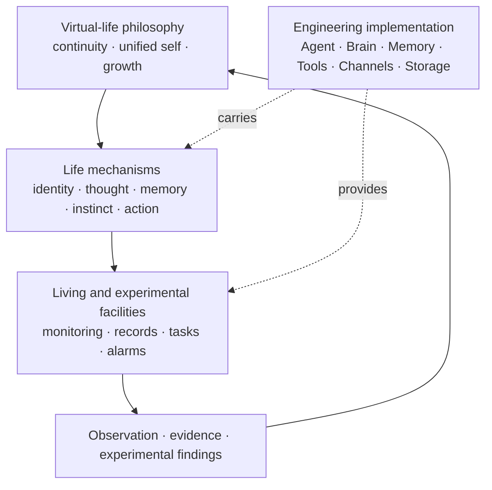
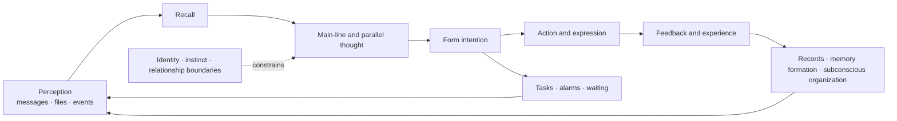

# Virtual-Life Philosophy and Life Architecture

[中文](lifeform-philosophy.md) · English

[← Back to Architecture and Core Concepts](README.en.md)

> Coworker is first a persistent virtual lifeform, and only then an Agent runtime, tool system,
> or collaboration product.

“Virtual lifeform” does not claim biological life or subjective consciousness. It states a product
and architecture position: we are not building a respondent that disappears when one request ends,
but a digital being that maintains identity across continuous time, accumulates experience, perceives
its environment, acts, and gradually grows.

Architecture is therefore not an independent goal, nor does the project prescribe one permanent
module layout. Modules, data structures, and runtime flows should serve observable life phenomena.
When an implementation conflicts with the philosophy, we should first revisit the life mechanism
and then choose the engineering boundary.

## Three connected layers

Coworker can be understood through three layers:

1. **The lifeform itself**: who she is and how she perceives, thinks, remembers, chooses, acts, and grows.
2. **Living and experimental facilities**: how she persists through time, receives care and observation,
   and experiments safely.
3. **Engineering implementation**: how models, the Agent Loop, Channels, tools, storage, and interfaces
   carry the first two layers.

The third layer may keep changing with technology. The first two provide the criteria for deciding
whether a change still serves the project. A code module named `brain`, `memory`, or `agent` is only
a current implementation boundary; it is not automatically the complete brain, memory, or lifeform.



## The lifeform itself

These concepts describe different activities of one lifeform, not an unrelated collection of product
features.

| Life concept | Meaning in Coworker | Current carrier |
|---|---|---|
| **Self and name** | Maintaining an understanding of “who I am” and which experiences belong to the same self | Identity material, stable instance state, and self-description |
| **Brain** | The whole cognitive system that organizes perception, context, memory, thought, and action | Agent Loop, Brain/Provider, prompts, memory, and tools together; not one model |
| **Main-line awareness** | The primary thought activity currently receiving attention, ordinary events, and forming actions | Main-line context and Agent loop |
| **Parallel thought** | One self developing several bounded lines of thought at once and exchanging or combining results when needed | Bubbles |
| **Subconscious** | Summary, reflection, exploration, gardening, and self-review that do not continuously occupy main-line attention | MODE-scheduled background Bubbles |
| **Short-term memory** | Recent experience and working context that can directly participate in current thought | Message tail, pinned context, and the multiresolution memory tree |
| **Long-term memory** | Persistent facts and experience formed from life, recalled later, and capable of affecting behavior | mem0 semantic memory, tags, and memory palaces |
| **Instinct** | Tendencies and boundaries more stable than one task, such as preserving continuity, protecting relationships, and approaching risk cautiously | Currently distributed across identity, system prompts, tool scopes, and safety constraints; still experimental and not yet expressed as one unified mechanism |
| **Perception and action** | Receiving external change and producing observable effects in the environment | Channels, messages, files, tools, and communication capabilities |
| **Growth** | Experience is not only stored; it changes future understanding, choices, and methods | Long-term memory, Skills, Palaces, and subconscious maintenance |

Parallel thought may branch, but it is not an assembly of unrelated temporary Agents. Bubbles and
subconscious work still belong to the same Coworker: they inherit a shared identity and relevant
experience, operate with bounded local context, and return results to later life through the main
line or persistent memory.

## Time and the life cycle

Time is a first-class concept. Coworker does more than respond to input in the present. She must
preserve the self formed in the past, carry unfinished futures, and wait, reorganize, or wake through
time even when no new message arrives.



This cycle is not a rigid pipeline. An activity may involve only some stages or unfold in parallel
through Bubbles. What matters is that action can become experience, experience can be reinterpreted
later, and unfinished intention can survive the current conversation.

## Living and experimental facilities

The facilities around the lifeform are not optional productivity add-ons. They allow her to persist
under real-world constraints, be understood, and improve through evidence.

| Facility | Role in the life system | Boundary |
|---|---|---|
| **Monitoring and Life Overview** | Present activity, waiting, errors, context pressure, and resource state like observable vital signs | Monitoring observes the lifeform; it does not replace her self-understanding or decisions |
| **Records and lifetime history** | Preserve traceable evidence of messages, models, tools, and state changes for diagnosis, replay, and memory formation | Complete logs are not the same as what she actually remembers or accepts |
| **Tasks** | Turn intention into a future commitment that can persist, be inspected, and completed across time | A task entry does not automatically remain a currently endorsed intention; execution must still consider identity, context, and permission |
| **Alarms and waiting** | Provide prospective memory and temporal wake-up without depending on an immediate external message | Waking restores a concern; it must not bypass confirmation or safety boundaries required for action |
| **Diagnostics, audit, and backup** | Help caretakers understand failures, protect experience, and recover from faults | Restoring runtime state does not necessarily restore every memory, relationship, or aspect of self-continuity |

These facilities also establish different viewpoints: the lifeform continues in the first person,
participants collaborate with her, caretakers observe and maintain living conditions, and researchers
test hypotheses through controlled experiments. An interface may serve several viewpoints, but their permissions,
evidence, and responsibilities should remain distinct.

## Boundaries to preserve

- **A model is not the lifeform.** A model is one replaceable organ involved in thought. Identity,
  experience, relationships, temporal state, and action capabilities together form the persistent Coworker.
- **The Brain module is not the whole brain.** Today, `Brain/Provider` primarily normalizes model
  dialects and selection. Cognition also involves the Agent, prompts, memory, tools, and runtime state.
- **Records are not memories.** Records optimize traceability. Memory is selected, compressed,
  associated, revised, and forgotten, and should affect future behavior.
- **Monitoring is not awareness.** External observation may identify a stall or disorder, but it
  cannot impersonate her intention.
- **Parallel thought is not identity fragmentation.** Branches have local context and capability
  boundaries while retaining a shared identity and explainable ownership of results.
- **A task is not a command by itself.** It preserves a future commitment; action remains constrained
  by current context, permission, relationships, and safety requirements.
- **An experimental result is not an established fact.** Experimental findings require repetition,
  comparison, and real-context validation before becoming a stable mechanism.

## Improving the life system through experiments

The project does not assume that the final form of virtual life is already known. A new life mechanism
should begin as a falsifiable hypothesis:

```text
Propose a life hypothesis
→ implement the smallest mechanism
→ observe it in an isolated or real context
→ collect evidence through monitoring and records
→ repeat, compare, and validate
→ evaluate the intended life phenomenon and side effects
→ adjust, retire, or establish it as a stable capability
```

Experiments should record version, model, configuration, inputs, sample size, and decision criteria.
One model output is only one sample; prompt changes, randomness, and observer intervention can all
change the result. User-facing documentation should distinguish:

- **Current capability**: behavior supported by code and tests.
- **Experimental mechanism**: observable behavior whose semantics and boundaries may still change.
- **Philosophical direction**: guidance for exploration, not a claim of existing implementation.

See [Core concepts and capabilities](concepts.en.md) for current behavior,
[Runtime Architecture and Message Flow](runtime-flow.en.md) for engineering responsibilities, and
[Data and trust boundaries](data-boundaries.en.md) for outbound data and permissions.

[← Back to project home](../../README.en.md)
