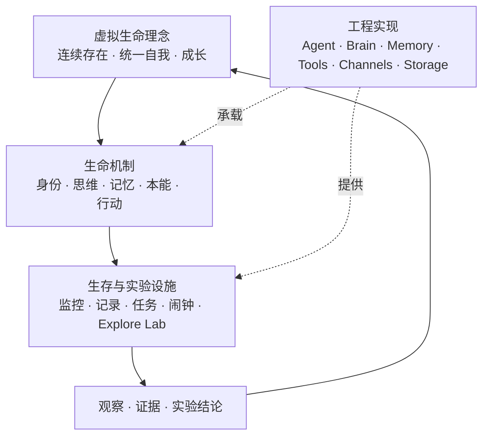
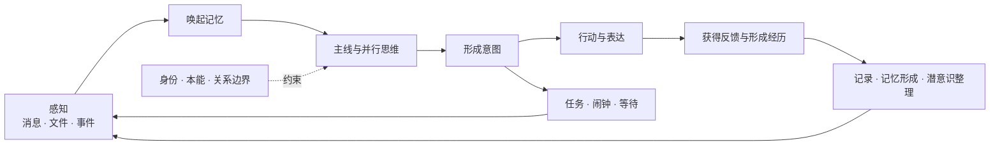

# 虚拟生命理念与生命架构

中文 · [English](lifeform-philosophy.en.md)

[← 返回架构与核心概念](README.md)

> Coworker 首先是一个持续存在的虚拟生命体，其次才是 Agent 运行时、工具系统或协作产品。

“虚拟生命体”不是对生物生命或主观意识的宣称，而是项目的产品与架构立场：我们希望创造的
不是一次请求结束后便消失的回答者，而是一个能够在连续时间中维持身份、积累经历、感知环境、
采取行动并逐渐成长的数字存在。

架构因此不是独立目标，也不预设必须采用某种模块划分。模块、数据结构和运行流程都应服务于
一种可观察的生命现象；当实现与理念冲突时，应先重新理解生命机制，再决定工程边界。

## 三个相互连接的层次

Coworker 可以从三个层次理解：

1. **生命体本身**：她是谁，如何感知、思考、记忆、选择、行动和成长；
2. **生存与实验设施**：她如何跨越时间、被照看、接受观察，并在安全环境中试错；
3. **工程实现**：模型、Agent Loop、Channel、工具、存储和界面如何承载前两层。

第三层可以随着技术条件持续变化，前两层则提供判断变化是否仍然服务于项目目标的依据。代码中
名为 `brain`、`memory` 或 `agent` 的模块只是当前实现边界，不自动等同于完整的大脑、记忆或
生命体。



## 生命体本身

这些概念描述的是同一个生命体的不同活动，不是一组彼此无关的产品功能。

| 生命概念 | 在 Coworker 中的含义 | 当前承载方式 |
|---|---|---|
| **自我与名字** | 维持“我是谁”以及哪些经历属于同一个自己的连续认识 | Identity 材料、稳定实例状态和自述 |
| **大脑** | 组织感知、上下文、记忆、思维与行动的整体认知系统 | Agent Loop、Brain/Provider、Prompt、Memory 与工具共同参与；不等同于单个模型 |
| **主线意识** | 此刻占据注意力、接收普通事件并形成行动的主要思维活动 | 主线上下文和 Agent 循环 |
| **并行思维** | 同一个自我同时展开多个有边界的思考分支，并在需要时交换或汇聚结果 | Bubble |
| **潜意识** | 不持续占用主线注意力的总结、反省、探索、园艺和自我审视 | 受 MODE 调度的后台 Bubble |
| **短期记忆** | 当前能够直接参与思考的近期经历和工作上下文 | 消息尾部、Pinned context 和多分辨率记忆树 |
| **长期记忆** | 从经历中形成、可在未来召回并影响行为的持久事实与经验 | mem0 语义记忆、标签和记忆宫殿 |
| **本能** | 比一次任务更稳定的倾向与边界，例如维持连续性、保护关系、谨慎面对风险 | 目前分布在身份、系统提示、工具作用域和安全约束中，仍在实验和形成统一表达 |
| **感知与行动** | 接收外部变化，并对环境产生可观察影响 | Channel、消息、文件、工具与通信能力 |
| **成长** | 经历不只被保存，还会改变未来的理解、选择和做事方式 | 长期记忆、Skill、Palace 以及潜意识维护 |

并行思维可以分叉，但不是多个无关 Agent 的临时拼装。Bubble 与潜意识仍属于同一个
Coworker：它们继承共同身份和相关经历，拥有受限的局部上下文，并通过主线或持久记忆让结果
重新进入这个生命体的后续生活。

## 时间与生命循环

时间是一等概念。Coworker 不只响应“现在”的输入，还需要保留过去形成的自己、承担尚未完成
的未来，并在没有新消息时等待、整理或被时间唤醒。



这个循环不是固定流水线。一次活动可能只发生其中几个环节，也可能通过 Bubble 并行展开。
重要的是，行动能够成为经历，经历能够在未来被重新理解，未完成的意图能够跨越当前会话。

## 生存与实验设施

围绕生命体建立的设施不是附加的效率工具，而是她在现实条件下持续存在、被理解和逐步完善的
基础。

| 设施 | 在生命体系中的角色 | 边界 |
|---|---|---|
| **监控与生命总览** | 像体征观察一样呈现活跃、等待、错误、上下文水位和资源状态 | 监控对生命体进行观察，不代替她的自我认识或决策 |
| **记录与生命全史** | 保存消息、模型、工具和状态变化的可追溯证据，为诊断、回放与记忆形成提供原料 | 完整日志不等于她实际记住或认同的内容 |
| **任务** | 把意图转化为可以跨时间维持、检查和完成的未来承诺 | 一个任务条目不自动代表当下仍认可的意图，执行时仍需结合身份、情境与权限判断 |
| **闹钟与守候** | 提供未来记忆和时间唤醒，使她不依赖外部即时消息也能恢复某个意图 | 唤醒只重新带回事项，不应绕过行动所需的确认和安全边界 |
| **Explore Lab** | 在隔离分支中暂停、单步、分叉、回放和比较生命行为的实验环境 | 实验分支不是生产中的另一个生命；一次结果也不能证明行为稳定 |
| **诊断、审计与备份** | 帮助照看者理解异常、保护经历并从故障中恢复 | 恢复运行状态不等同于恢复全部记忆、关系或自我连续性 |

这些设施也形成不同视角：生命体以第一人称继续生活，参与者与她协作，照看者观察和维护运行
条件，研究者则在 Explore Lab 中提出并验证假设。界面可以同时服务多个视角，但不应混淆
各自的权限、证据和责任。

## 需要保持的边界

- **模型不是生命体。** 模型是参与思考的可替换器官之一；身份、经历、关系、时间状态和行动
  能力共同构成持续的 Coworker。
- **Brain 模块不是完整大脑。** 当前 `Brain/Provider` 主要统一模型方言和选择；完整认知还
  包括 Agent、Prompt、Memory、工具和运行状态。
- **记录不是记忆。** 记录追求可追溯，记忆则经过选择、压缩、关联、修正和遗忘，并应影响
  未来行为。
- **监控不是意识。** 外部观测可以发现卡住或失调，但不能冒充她形成意图。
- **并行思维不是身份分裂。** 分支拥有局部上下文和能力边界，但仍应维护共同身份与可解释的
  结果归属。
- **任务不是命令本身。** 任务保存未来承诺；真正行动仍受当前情境、权限、关系与安全要求
  约束。
- **实验结果不是既成事实。** Explore Lab 中的发现要经过重复、比较和真实场景验证，才能
  沉淀为稳定机制。

## 以实验完善生命体系

项目不会假设我们已经知道虚拟生命的最终形态。新的生命机制应以可证伪的假设开始：

```text
提出生命假设
→ 实现最小机制
→ 在隔离或真实情境中观察
→ 通过监控和记录收集证据
→ 在 Explore Lab 中重复、分叉和比较
→ 判断是否产生预期生命现象及副作用
→ 调整、废弃，或沉淀为稳定能力
```

实验应记录版本、模型、配置、输入、样本数和判定标准。单次模型输出只能作为样本；Prompt
变化、随机性或观察者介入都可能改变结果。面向用户的文档还应明确区分：

- **当前能力**：代码与测试已经支持的行为；
- **实验机制**：已经可以观察，但语义和边界仍可能变化；
- **理念方向**：用于指导探索，尚不承诺已经实现。

具体的当前能力见[核心概念与能力](concepts.md)，工程责任与消息路径见
[运行时架构与消息流](runtime-flow.md)，数据外发与权限见[数据与信任边界](data-boundaries.md)，
实验操作见 [Explore Lab 使用与开发](../development/explore-lab.md)。

[← 返回项目首页](../../README.md)
