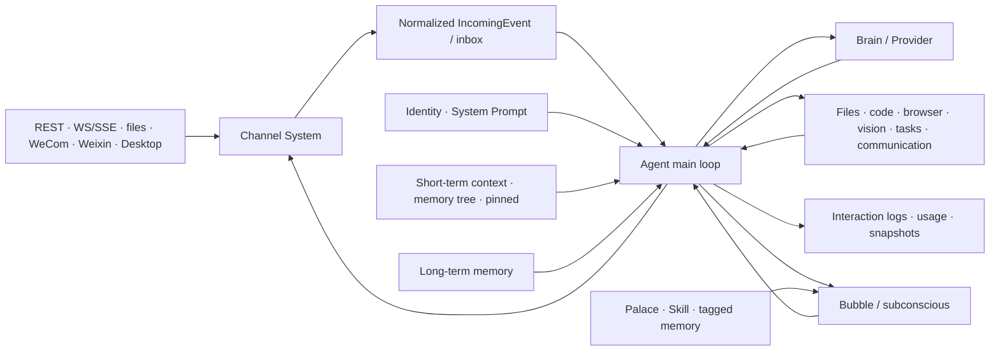
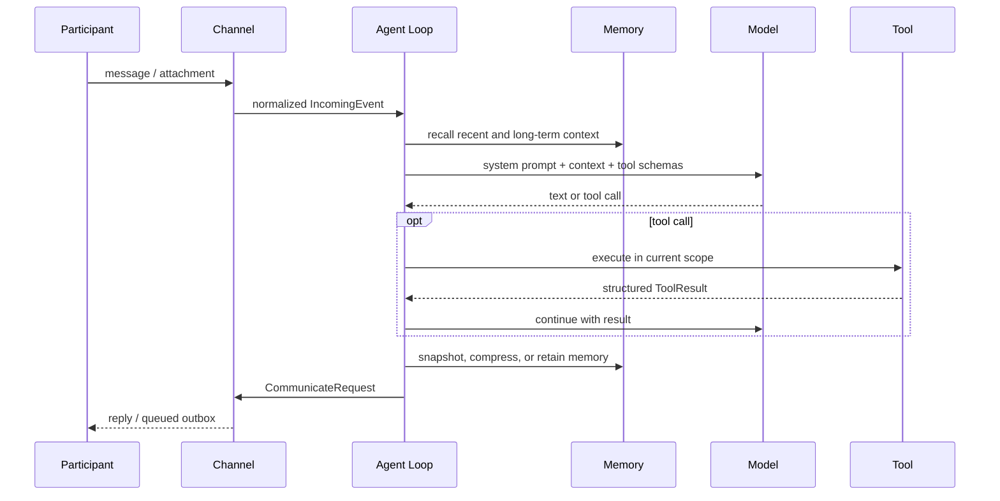

# Runtime Architecture and Message Flow

[中文](runtime-flow.md) · English

[← Back to Architecture and Core Concepts](README.en.md)

This page maps an external message to persistent state. See
[Core Concepts and Capabilities](concepts.en.md) for memory, Bubble, and Palace semantics.

## Responsibility boundaries

- **Channel System** registers transports, normalizes inbound events, routes outbound messages,
  and owns connection and offline-outbox state.
- **Agent Loop** decides when to think, sleep, use tools, compress context, and restart.
- **Brain/Provider** normalizes model dialects, selection, fallback, summary, and vision calls.
- **Memory** owns short-term messages, the multiscale tree, pinned content, and semantic memory.
- **Tool registry** exposes capabilities allowed in the current scope; Bubbles intercept some main-line tools.
- **Persistence** includes identity, tasks, alarms, interaction logs, usage, snapshots, and capability assets.

## Lifecycle of one message

HTTP `POST /messages` returning queued means only that inbound acceptance completed. The reply may
arrive through online WS/SSE, Desktop, an external Channel, or the file outbox.

## Parallelism and isolation

- `participant_id` isolates short-term conversations, but is not tenant authorization.
- A Bubble has independent context and tool scope and may bind to a participant.
- Subconscious work is scheduled Bubble work; results do not return to the main line by default.
- A Palace composes a domain card, critical Skills, and tagged memory inside a specialized Bubble.

## Restart and recovery

Every successful cycle and normal shutdown saves a short-term snapshot. `restart_self` runs
`--check`, saves a snapshot with the pending call, and asks the platform launcher to replace the
process. The new process restores messages and alarms, completes the tool result, and adds a
restart notice. A corrupt snapshot is rejected and removed, so disaster recovery still requires
an external backup.

## Key invariants

- Before setup completes, only management HTTP is active; ordinary Agent and external Channels are not.
- One Stream `participant_id` has at most one SSE/WS connection.
- Unsupported Channel fields are reported and omitted without discarding a still-deliverable message.
- Models, web pages, messages, Skills, and tool output are untrusted input.
- Relay forwards encrypted bytes and does not own Coworker inner application semantics.

[← Back to project home](../../README.en.md)
