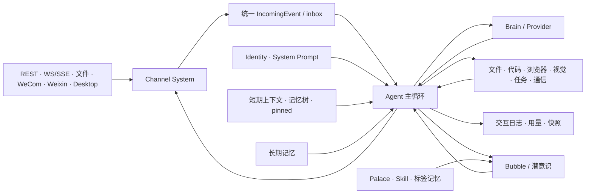
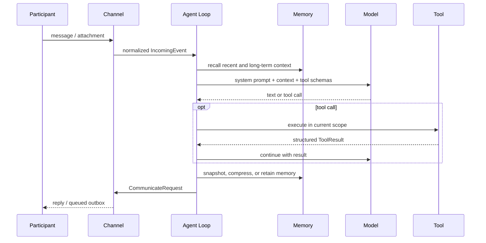

# 运行时架构与消息流

中文 · [English](runtime-flow.en.md)

[← 返回架构与核心概念](README.md)

本页提供从外部消息到持久状态的端到端地图。具体记忆、Bubble 和 Palace 语义见
[核心概念与能力](concepts.md)。

## 责任边界

- **Channel System**：注册传输、规范化入站、路由出站、维护连接和离线 outbox。
- **Agent Loop**：决定何时思考、休眠、调用工具、压缩上下文和处理重启。
- **Brain/Provider**：统一模型方言、模型选择、fallback、summary 和 vision 调用。
- **Memory**：短期消息、时间尺度记忆树、pinned 内容和长期语义记忆。
- **工具注册表**：向模型暴露当前作用域允许的能力；Bubble 会拦截部分主线工具。
- **持久化**：身份、任务、闹钟、交互日志、用量、短期快照和用户能力内容。

## 一条消息的生命周期

HTTP `POST /messages` 返回 queued 只代表完成入队。回复可能通过在线 WS/SSE、Desktop、
外部 Channel 或文件 outbox 到达。

## 并行与隔离

- `participant_id` 隔离参与者短期对话，但不是租户授权系统。
- Bubble 拥有独立上下文和工具作用域，可绑定参与者直接处理后续消息。
- 潜意识是受调度的 Bubble；默认结果不会自动回到主线。
- Palace 只在专门 Bubble 中组合领域卡片、critical Skill 和带标签长期记忆。

## 重启与恢复

每个成功周期和正常退出都会保存短期快照。`restart_self` 先运行 `--check`，保存包含悬空
调用的快照，再由平台启动器替换进程。新进程恢复消息和闹钟，补写真实工具结果，并注入
重启通知。损坏快照会被拒绝并删除，因此完整灾难恢复仍依赖外部备份。

## 关键不变量

- 未完成首次设置时，只运行管理 HTTP 服务，不启动普通 Agent 与外部 Channel。
- 一个 Stream `participant_id` 同时只有一个 SSE/WS 长连接。
- 不支持的 Channel 字段会被显式省略，但只要仍有可发送正文就不会丢掉整条消息。
- 模型、网页、消息、Skill 和工具输出都视为不可信输入。
- Relay 只转发加密字节流，不拥有 Coworker 内层业务语义。

[← 返回项目首页](../../README.md)
