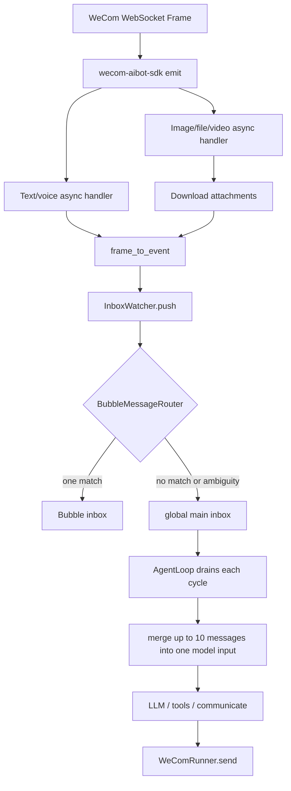
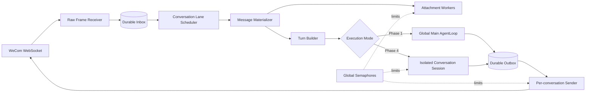
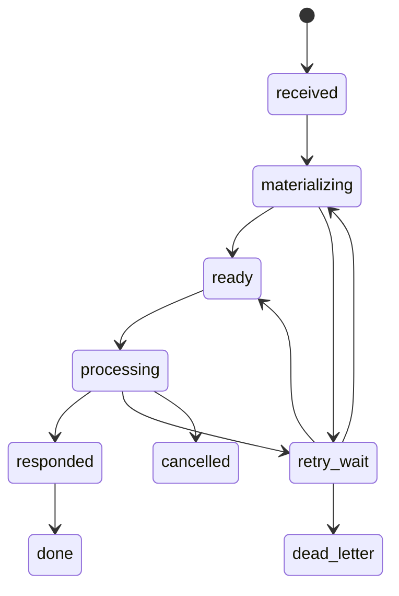

# WeCom Message Ordering, Reliability, and Concurrency Design

[中文](wecom-message-ordering-and-concurrency.md) · English

[← Back to Channels and Clients](README.en.md)

> Status: **Proposal**
>
> Scope: WeCom ingress, agent scheduling, Bubble handoff, and WeCom egress
>
> Delivery: staged; the current main loop does not need to be replaced at once

## 1. Summary and decisions

Today, WeCom messages eventually enter an in-memory `asyncio.Queue` and are consumed serially by the main AgentLoop. Complex work may run concurrently in Bubbles. This works, but it only preserves the order in which preprocessing finishes and messages enter the queue. It does not preserve the original WeCom order and does not provide durable backlog, message idempotency, exact reply correlation, or serialized egress per conversation.

This proposal adopts the following target model:

1. **Strict order within one WeCom conversation**: at most one turn is processed at a time for a conversation.
2. **Bounded concurrency across conversations**: attachment preparation, isolated conversation execution, and sending may run concurrently under global limits.
3. **Register before slow work**: persist identity and order as soon as a frame arrives, before downloading attachments.
4. **At-least-once receipt with effectively-once business handling**: accept upstream retries, while a unique `msgid` constraint and state machine prevent repeated execution and replies.
5. **Replies correlate to a specific inbound message**: use the current turn's `reply_context`, not the latest frame seen for a chat.
6. **One outbound lane per conversation**: chunks and attachments belonging to one logical reply cannot be interleaved with another reply.
7. **Staged migration**: fix ordering and idempotency at the channel boundary first, add durability next, and only then execute multiple agent conversations concurrently.

The recommended core abstraction is:

> **Conversation Lane (ordered mailbox) + Global Semaphore (cross-conversation limit) + Durable Inbox/Outbox (recoverable delivery state)**

---

## 2. Background and current implementation

### 2.1 Current ingress path



Relevant implementation areas:

| Stage | Current code | Current semantics |
|---|---|---|
| SDK handler registration | `src/coworker/channels/wecom/runner.py` | Registers separate asynchronous handlers for text and attachment events |
| Frame conversion | `src/coworker/channels/wecom/adapter.py` | Builds `IncomingEvent`; timestamp is local conversion time |
| Main inbox | `src/coworker/agent/inbox_watcher.py` | Unbounded in-memory `asyncio.Queue` |
| Main-loop batching | `src/coworker/agent/loop.py` | Drains the queue and merges up to `inbox_batch_max` events |
| Bubble routing | `src/coworker/agent/bubble_router.py` | Routes on one unambiguous match; otherwise keeps the event on main |
| Bubble concurrency | `src/coworker/agent/bubble.py` | Global `bubble_max_concurrent`, default 5 |
| WeCom sending | `src/coworker/channels/wecom/runner.py` | Keeps only the latest frame per chat and consumes it on the first send |

### 2.2 Existing ordering safeguards to preserve

- The main AgentLoop has one execution task and does not concurrently mutate main short-term context.
- Tool calls within a main cycle execute sequentially.
- `asyncio.Queue` preserves FIFO for events whose `put` operations have completed.
- A Bubble receives communication only when its binding is unambiguous; multiple candidates safely fall back to main.
- Bubble results re-enter through the main inbox on a later cycle rather than modifying context in the middle of tool execution.
- During finalization, a Bubble returns unconsumed external events to the main inbox.
- Bubble creation and resume are constrained by a global concurrent-Bubble limit.

These safeguards protect in-process structural integrity. They are not end-to-end WeCom ordering guarantees.

### 2.3 Gaps

#### Gap A: attachments can reorder ingress

The SDK schedules asynchronous handlers as independent tasks. If image A requires a download, later text B can finish first:

```text
WeCom sends: A(image) → B(please analyze this image)
Current enqueue order may be: B → A
```

#### Gap B: replies correlate to the latest frame, not the current turn

The current `_frame_cache` is keyed by `chat_id`. If A and B arrive consecutively, B replaces A's frame. A reply produced while processing A may call `reply_stream` with B's frame.

#### Gap C: no WeCom message idempotency

The frame `msgid` is not carried into `IncomingEvent` and has no unique constraint. Reconnect replay or upstream retries can execute the same message twice.

#### Gap D: the main queue is neither durable nor bounded

Pending events exist only in memory. A crash loses them, while sustained overload grows memory without bound. There are no `queued`, `processing`, or `failed` states, leases, or dead letters.

#### Gap E: participants are mixed in one batch

The main loop drains all events and merges the first `inbox_batch_max` into one user message. Different users, direct chats, and group chats can enter one model call.

#### Gap F: conversation isolation is not wired into main execution

`ConversationThread` and `ShortTermMemory.threads` exist, but inbound processing still writes to shared `short_term.primary`. Current isolation relies mainly on participant labels and prompt instructions rather than isolated conversation execution context.

#### Gap G: no per-chat serialization on egress

Main, Bubbles, handoff notices, and chunks of long messages may call `WeComRunner.send()` concurrently. One chat has no lock or sender worker, so logical replies may interleave.

---

## 3. Goals and non-goals

### 3.1 Goals

- Deliver inbound messages to agent turns in first-received order within each `conversation_key`.
- Prevent attachment completion order from changing message order.
- Produce at most one business turn and one logical reply for one WeCom `msgid`.
- Recover unfinished inbound and outbound work after restart.
- Permit one in-flight turn per conversation and bounded concurrency across conversations.
- Keep all chunks and attachments of one logical reply contiguous.
- Define append, coalesce, cancel, and interrupt semantics.
- Expose backlog, latency, retries, failures, and per-conversation state to operators.
- Preserve Bubble task concurrency while assigning each communication Bubble to one conversation.

### 3.2 Non-goals

- No global business ordering across unrelated WeCom conversations.
- No multi-node distributed consensus; the target remains a single local-first instance.
- No claim of network-level exactly-once. The target is at-least-once receipt plus idempotency for effectively-once business handling.
- Phase 1 will not call the shared main `AgentLoop` concurrently.
- A WeCom user identity is not a permission or tenant boundary.

---

## 4. Core invariants

Implementation and tests must maintain these invariants:

1. **Inbound uniqueness**: `(channel, account_id, source_message_id)` is unique.
2. **Lane ordering**: only the smallest unfinished sequence in one `conversation_key` may be claimed.
3. **One in-flight turn per conversation**: at most one turn is `processing` in a lane.
4. **Slow work cannot reorder**: attachment completion does not change `arrival_seq`.
5. **No cross-conversation batching**: one agent turn contains exactly one `conversation_key`.
6. **Traceable replies**: every outbound item references a `turn_id` and explicit `reply_context`.
7. **Ordered egress**: `outbound_seq` increases within a lane, and chunks from one logical reply cannot interleave.
8. **Recoverable claims**: an expired lease can be reclaimed after a worker crash.
9. **No repeated side effects after success**: replay of a completed turn returns the existing outcome or remains silent.
10. **Bounded and observable queues**: saturation must create backpressure, degradation, or an alert rather than unbounded memory growth.

---

## 5. Target architecture



### 5.1 Responsibilities

#### Raw Frame Receiver

- Validate, extract minimal metadata, and persist inside the SDK handler.
- Do not download attachments, call a model, or wait for business processing.
- Assign a monotonic `arrival_seq` on first receipt.
- Insert idempotently by `msgid`.

#### Durable Inbox

- Store identity, order, state, retry, and reply-correlation data.
- Use SQLite WAL, which fits Coworker's single-machine local-first deployment.
- A successful database write means Coworker has accepted responsibility for the message.

#### Conversation Lane Scheduler

- Organize ordered mailboxes by `conversation_key`.
- Run one worker/actor per active lane.
- Bound concurrent lanes with a global semaphore.
- Claim only the executable head of each lane.

#### Message Materializer

- Convert raw frames into model-visible content.
- Download attachments and build `AttachmentData`.
- Attachments inside one message may download concurrently, but later messages cannot pass that message before it becomes ready.

#### Turn Builder

- Batch only consecutive messages from one lane.
- Support a short quiet window for bursty user input.
- Produce a stable `turn_id`, ordered source message IDs, and `reply_context`.

#### Executor

- Keep the single main AgentLoop in Phase 1.
- Later add isolated Conversation Sessions for concurrent LLM execution.
- Concurrent execution must use isolated short-term context and must never mutate shared `short_term.primary` concurrently.

#### Durable Outbox / Sender

- Commit a logical reply to the outbox before delivery.
- Run one sender per conversation lane.
- Own chunking, media upload, retries, and final delivery state.

---

## 6. Identity and data model

### 6.1 Conversation key

Use a stable and unambiguous internal key:

```text
Direct: wecom:{bot_id}:single:{userid}
Group:  wecom:{bot_id}:group:{chatid}
```

Keep the existing model-facing `participant_id`:

```text
wecom:single:{userid}
wecom:group:{chatid}
```

`participant_id` is a communication address. `conversation_key` is the scheduling and persistence key and includes the bot account to avoid collisions across multiple bots. WeCom currently does not support the generic `conversation_id` field, so lane identity must not depend on it.

### 6.2 Inbound envelope

Introduce a channel envelope separate from model messages:

```python
@dataclass(frozen=True)
class ChannelEnvelope:
    id: str
    channel: str                    # "wecom"
    account_id: str                 # bot_id
    source_message_id: str          # body.msgid
    conversation_key: str
    participant_id: str
    sender_id: str                  # actual userid in a group
    chat_type: str                  # single / group
    received_at: datetime
    source_timestamp: datetime | None
    arrival_seq: int
    payload: dict                   # controlled raw/normalized frame
    reply_context: dict             # req_id, msgid, replyable frame data
```

`IncomingEvent` may add these fields or be materialized from the envelope:

```python
source_message_id: str | None
conversation_key: str | None
received_at: datetime | None
source_timestamp: datetime | None
arrival_seq: int | None
turn_id: str | None
reply_context_id: str | None
```

### 6.3 State machine



| State | Meaning |
|---|---|
| `received` | Identity and order are durable |
| `materializing` | Attachments or normalized content are being prepared |
| `ready` | Available to a conversation lane |
| `processing` | Claimed by an executor |
| `responded` | A reply has been committed to the durable outbox |
| `done` | No reply is required, or required egress is complete |
| `retry_wait` | Retryable failure under backoff |
| `dead_letter` | Retry limit exceeded; operator action required |
| `cancelled` | Deterministically cancelled with an audit record |

### 6.4 Suggested SQLite schema

The following is a logical structure rather than a frozen migration:

```sql
CREATE TABLE channel_inbox (
    id TEXT PRIMARY KEY,
    channel TEXT NOT NULL,
    account_id TEXT NOT NULL,
    source_message_id TEXT NOT NULL,
    conversation_key TEXT NOT NULL,
    participant_id TEXT NOT NULL,
    sender_id TEXT NOT NULL,
    arrival_seq INTEGER NOT NULL,
    received_at TEXT NOT NULL,
    source_timestamp TEXT,
    payload_json TEXT NOT NULL,
    reply_context_json TEXT,
    state TEXT NOT NULL,
    attempt_count INTEGER NOT NULL DEFAULT 0,
    lease_owner TEXT,
    lease_until TEXT,
    next_attempt_at TEXT,
    last_error TEXT,
    turn_id TEXT,
    created_at TEXT NOT NULL,
    updated_at TEXT NOT NULL,
    UNIQUE(channel, account_id, source_message_id),
    UNIQUE(arrival_seq)
);

CREATE INDEX idx_inbox_lane_head
ON channel_inbox(conversation_key, state, arrival_seq);

CREATE TABLE channel_outbox (
    id TEXT PRIMARY KEY,
    turn_id TEXT NOT NULL,
    conversation_key TEXT NOT NULL,
    participant_id TEXT NOT NULL,
    outbound_seq INTEGER NOT NULL,
    reply_context_json TEXT,
    message TEXT NOT NULL,
    attachments_json TEXT NOT NULL,
    state TEXT NOT NULL,
    attempt_count INTEGER NOT NULL DEFAULT 0,
    next_attempt_at TEXT,
    last_error TEXT,
    created_at TEXT NOT NULL,
    updated_at TEXT NOT NULL,
    UNIQUE(conversation_key, outbound_seq)
);
```

Assign sequences in the same transaction as insertion. A SQLite autoincrement key can provide global `arrival_seq`; only relative order within a lane is a business invariant.

---

## 7. Ingress ordering and idempotency

### 7.1 Handlers must return quickly

Replace attachment-before-enqueue behavior with immediate registration:

```python
async def _on_message(frame):
    envelope = normalize_minimal(frame)
    result = await durable_inbox.insert_if_absent(envelope)
    ingress_wakeup.set()
    return result
```

A background materializer performs slow work.

### 7.2 Idempotency key

Preferred key:

```text
(channel="wecom", account_id=bot_id, source_message_id=body.msgid)
```

For rare events without `msgid`:

- Do not include current time in the key.
- Use `req_id + chat_id + msgtype + normalized payload hash`.
- Record `dedupe_key_source=fallback` for observability.

Duplicate behavior:

| Existing state | Behavior on duplicate receipt |
|---|---|
| `received` through `processing` | Update `last_seen_at`; do not enqueue again |
| `responded` / `done` | Acknowledge silently; do not execute or reply again |
| `retry_wait` | Preserve backoff and update observation data only |
| `dead_letter` | Count the duplicate; only explicit operator action reopens it |

### 7.3 Ordering definition

The guaranteed order is the order in which one instance first persists each message. A trustworthy upstream time or sequence may be stored for audit, but timestamps alone must not define order because precision, clock skew, and replay create ambiguity.

---

## 8. Attachment materialization

### 8.1 Head-of-line behavior

If message A in one conversation is still downloading attachments, later message B may be accepted and persisted but may not pass A into an agent turn.

This is intentional:

- It preserves semantic order.
- A slow attachment blocks only that conversation.
- Other conversations continue through independent lanes.

### 8.2 Timeout and failure

Configure per-attachment timeout, per-message materialization timeout, a global download limit, exponential backoff, and a maximum attempt count.

After retry exhaustion:

1. **Strict mode**: dead-letter the message and pause the lane to prevent loss of context.
2. **Degraded mode**: materialize an explicit attachment-failure placeholder and let the lane continue.

Images and files should default to degraded mode with a visible warning in model content and logs. Security- or business-critical deployments may select strict mode.

---

## 9. Turn building and batching

### 9.1 No cross-conversation batching

Replace global drain-and-slice behavior with lane-head selection. Every turn must satisfy:

```text
all messages have the same conversation_key
arrival_seq values strictly increase
all messages are ready
```

### 9.2 Same-conversation batching

A short quiet window can absorb consecutive user input:

```text
quiet_window_ms = 400–800ms
max_messages_per_turn = 10
max_turn_wait_ms = 1500ms
```

Rules:

- Start the quiet window when the first message becomes ready.
- Merge new messages from the same lane during the window.
- An unready attachment message forms a boundary and cannot be skipped.
- Explicit cancel or interrupt commands do not merge with ordinary content.
- Build immediately at the message or maximum-wait limit.

### 9.3 Reply-context selection

For one logical reply to a batch, default to the last replyable frame in the batch and retain every `source_message_id` in the turn. If product behavior requires per-message acknowledgement, create multiple outbox items explicitly instead of asking the sender to infer intent.

---

## 10. Execution concurrency model

### 10.1 Phase 1: keep the global main agent serial

Initially change only ingress and scheduling:

```text
Ordered backlog in multiple conversation lanes
        ↓
Fair scheduler selects one ready turn
        ↓
Current AgentLoop executes serially
```

Benefits:

- Correct order, no mixed batches, deduplication, and recovery can be delivered without immediately restructuring model context.

Limitation:

- Different users still share one main execution slot, so a long task delays other lanes.

### 10.2 Phase 4: isolated concurrent conversation sessions

Before real cross-conversation model concurrency, introduce `ConversationSession`:

```python
class ConversationSession:
    conversation_key: str
    participant_id: str
    short_term: ShortTermMemory
    mailbox: OrderedMailbox
    active_turn_id: str | None
```

Each session:

- Shares identity, system prompt, skills, palaces, and long-term-memory services.
- Owns isolated short-term conversation context.
- Executes serially within the session.
- Runs concurrently with other sessions under `conversation_max_concurrent`.

Multiple sessions must never write shared `short_term.primary` concurrently. Global self-activity should use a separate main stream or structured summaries rather than a shared mutable transcript.

### 10.3 Fairness

Use round-robin or oldest-lane-first scheduling rather than always selecting the globally oldest message:

- FIFO remains mandatory inside each lane.
- Rotate among lanes so a busy group chat cannot starve direct chats.
- Add `max_consecutive_turns_per_lane`, default 1.
- System and administrator messages may have controlled priority, but cannot interrupt an already claimed turn inside the same conversation.

---

## 11. New messages, cancellation, and interruption

Distinguish four behaviors:

| Type | Default behavior |
|---|---|
| Ordinary message | `append` after the current turn |
| Rapid follow-up before execution | `coalesce` into the pending turn |
| Explicit cancellation | `cancel` cancellable work |
| High-priority correction | `interrupt` at a safe checkpoint; never forcibly kill a non-rollbackable tool |

### 11.1 Safe checkpoints

New input cannot be inserted arbitrarily inside an LLM request or tool call. Check at:

- Before an LLM request starts.
- After a full group of tool calls completes.
- At the start of each Bubble cycle.
- After a background code job returns.

### 11.2 Cancellation

- An unclaimed turn can be marked `cancelled` directly.
- An active LLM request may be cancelled when the provider supports it and context remains valid.
- An external side effect already in progress cannot be assumed to roll back; inspect completion and report the real state.
- “Stop” semantics should be triggered by an explicit command or UI metadata, not only free-form model interpretation.

---

## 12. Bubble integration

A Bubble is a task-parallelism unit, not the base message queue.

### 12.1 Ownership

Add or clarify:

```text
bubble.owner_conversation_key
bubble.owner_turn_id
bubble.participant_id
bubble.conversation_id (where the channel supports it)
```

### 12.2 Routing constraints

- By default, only one communication-handoff Bubble may own a `conversation_key`.
- Non-communication Bubbles do not occupy the handoff slot.
- Multiple candidates should no longer fall back indefinitely to shared main; creation of a second handoff Bubble should be rejected and logged as a conflict.
- Follow-up messages reach the Bubble in lane order.

### 12.3 Finalization order

Define one lane order:

```text
Bubble final direct reply, if any
→ Bubble end notice
→ Bubble result merged into the session
→ user messages received during finalization
```

All steps use the same conversation outbox rather than allowing main and Bubble to call the WeCom sender independently.

### 12.4 Concurrency quotas

Keep `bubble_max_concurrent` separate from `conversation_max_concurrent`:

- Conversation quota limits simultaneous external conversations.
- Bubble quota limits internal subtask parallelism.
- A global LLM semaphore prevents the combined total from exceeding provider limits.

---

## 13. Egress ordering and exact reply correlation

### 13.1 Remove “one latest frame per chat” semantics

Replacement:

- The durable inbox stores `reply_context` per inbound message.
- A turn selects an explicit `reply_context_id`.
- The outbox carries that context.
- The sender consumes only the frame/token named by the outbox item.

If the frame expires, fall back to proactive `send_message` while retaining lane order.

### 13.2 Atomic logical replies

One outbox item can contain text and attachments:

```python
OutboundMessage(
    message="...",
    attachments=[...],
    reply_context=...,
)
```

While owning the lane, the sender completes text chunks, media uploads, media sends, and state commit in order. Another logical reply cannot enter between those steps.

### 13.3 Outbound idempotency

If WeCom has no idempotency key, a crash after remote success but before local commit can still produce uncertainty. Mitigations:

- Use stable outbox IDs.
- Pass stable `req_id` or an idempotency value when the SDK supports it.
- Record every attempt before and after sending.
- Mark ambiguous outcomes `delivery_unknown` instead of retrying forever.
- Let operators explicitly resend or mark complete.

---

## 14. Backpressure, rate limits, and resource boundaries

Suggested independent limits:

```env
WECOM__INGRESS_QUEUE_MAX=1000
WECOM__MATERIALIZE_MAX_CONCURRENT=4
WECOM__ATTACHMENT_DOWNLOAD_TIMEOUT_SECONDS=30
WECOM__MESSAGE_MATERIALIZE_TIMEOUT_SECONDS=60
WECOM__SEND_MAX_CONCURRENT=4
WECOM__MAX_ATTEMPTS=5
WECOM__RETRY_BASE_SECONDS=2

AGENT__CONVERSATION_MAX_CONCURRENT=4
AGENT__CONVERSATION_MAX_PENDING_PER_LANE=100
AGENT__CONVERSATION_QUIET_WINDOW_MS=600
AGENT__CONVERSATION_MAX_MESSAGES_PER_TURN=10
AGENT__LLM_MAX_CONCURRENT=6
```

- The durable inbox is the primary buffer; in-memory queues hold only bounded work or wake-up keys.
- Saturation of one lane should alert or return a busy notice without blocking other lanes.
- Disk or global saturation must stop the creation of unbounded handler tasks and emit a high-priority operational alert.
- Provider concurrency and rate limits require a global gate above conversation and Bubble concurrency.

---

## 15. Observability and administration

### 15.1 Metrics

At minimum:

- `wecom_inbound_received_total`
- `wecom_inbound_duplicate_total`
- `wecom_inbound_dead_letter_total`
- `wecom_inbox_depth`
- `wecom_lane_depth{conversation}` with redaction in displays
- `wecom_oldest_pending_seconds`
- `wecom_materialize_seconds`
- `wecom_turn_wait_seconds`
- `wecom_turn_processing_seconds`
- `wecom_outbox_depth`
- `wecom_send_retry_total`
- `wecom_delivery_unknown_total`
- `conversation_active_count`
- `conversation_queue_saturation_total`

### 15.2 Correlation fields

Carry these fields from receipt to egress:

```text
source_message_id
conversation_key_hash
arrival_seq
turn_id
bubble_id (optional)
outbox_id
attempt
state_from / state_to
```

Raw user IDs, chat IDs, and message content follow existing redaction and data-boundary rules.

### 15.3 Administrative controls

Provide:

- Inbox and outbox views by state.
- Lane head, depth, active turn, and age.
- Dead-letter actions: retry, skip and continue, or mark complete.
- Manual resend/confirm for `delivery_unknown`.
- Pause and resume for one lane.
- Bubble handoff state for a lane.

---

## 16. Security and retention

Persisting frames expands the local sensitive-data surface and must follow [Data and trust boundaries](../architecture/data-boundaries.en.md):

- Store only fields required for recovery; do not retain irrelevant headers.
- Never persist secrets or authentication values in payloads.
- Configure retention for completed inbox/outbox rows, for example seven days.
- Keep randomized attachment names and record owning message plus cleanup time.
- Do not expose full raw frames through the admin API; return redacted summaries by default.
- Keep SQLite and attachment directories within the existing trusted local boundary.

---

## 17. Suggested code layout

Keep responsibilities out of an ever-growing `WeComRunner`:

```text
src/coworker/channels/wecom/
├── adapter.py              # frame normalization, no scheduling
├── runner.py               # connection lifecycle and handler registration
├── envelope.py             # ChannelEnvelope and conversation key
├── inbox_store.py          # SQLite durable inbox
├── materializer.py         # attachments and IncomingEvent creation
├── scheduler.py            # conversation-lane scheduling
├── outbox_store.py         # durable outbox
└── sender.py               # ordered per-conversation sender

src/coworker/agent/
├── conversation.py         # session and turn models
├── conversation_scheduler.py
└── loop.py                 # Phase 1 compatibility, later turn executor
```

If Desktop or REST later reuse these capabilities, move proven common pieces under `src/coworker/channels/base/`. Do not generalize every channel before the WeCom semantics and tests are stable.

---

## 18. Staged delivery plan

### Phase 0: behavior tests first

Add deterministic reproductions for:

- Delayed image download allows later text to pass.
- Consecutive A/B frames replace A with B in the current cache.
- Duplicate `msgid` executes twice.
- Main and Bubble chunks interleave.
- Multiple participants enter one model batch.

### Phase 1: in-memory ordered lanes

- Add `source_message_id`, `conversation_key`, `arrival_seq`, and `reply_context`.
- Register raw messages before asynchronous materialization.
- Use one worker per lane.
- Prohibit cross-lane batching.
- Add a per-chat outbound lock or queue.
- Deduplicate `msgid` in a process-local TTL cache.

This quickly fixes the main correctness defects but does not survive restart.

### Phase 2: durable inbox

- Add SQLite WAL, the state machine, leases, retries, and dead letters.
- Recover non-terminal messages on startup.
- Add capacity and backlog metrics.
- Stop using an unbounded memory queue as the business-message store.

### Phase 3: durable outbox and exact frames

- Let `CommunicateRequest` or channel context carry `reply_context_id`.
- Persist logical replies.
- Use one sender per lane and atomic reply chunking.
- Handle `delivery_unknown`.

### Phase 4: conversation sessions

- Refactor main execution from “read the global inbox” to “execute one turn.”
- Give each conversation isolated short-term context.
- Enable cross-conversation concurrency under a global semaphore.
- Redefine how global self-activity receives safe summaries from conversations.

### Phase 5: productized interruption and administration

- Add structured cancel/interrupt semantics.
- Add queue, dead-letter, and lane controls to the admin UI.
- Add busy notices, queue position, and saturation alerts.

---

## 19. Test matrix

| Scenario | Expected result |
|---|---|
| Same conversation: image A is slow, text B arrives later | Agent still sees A → B |
| Different conversations: A is slow, B is text | B is not blocked by A |
| Same `msgid` arrives twice | One inbox row and one turn |
| Process crashes in `ready` | Processing resumes after restart |
| Process crashes while holding a lease | Claim resumes after lease expiry |
| Process crashes before an outbox item is sent | Item sends after restart |
| Remote send succeeds, process crashes before commit | Delivery becomes uncertain; no infinite retry |
| Two long replies in one conversation | Each remains contiguous; chunks do not interleave |
| Main and Bubble reply concurrently | Both enter one ordered outbox |
| Two Bubbles request the same handoff conversation | Second handoff is rejected or reported as a conflict |
| Ten conversations arrive together | Concurrency stays bounded; lane order remains intact |
| Busy group chat sends continuously | Other lanes still receive execution time |
| One lane reaches its limit | Only that lane is limited and an alert is emitted |
| Attachment download fails permanently | Configured degraded or dead-letter behavior is observable |
| An unclaimed turn is cancelled | Marked cancelled without model or tool execution |
| Cancellation arrives during an external side effect | Handled at a safe checkpoint without pretending rollback |

In addition to unit tests, add deterministic integration tests with a fake WeCom client that controls download delay, send completion, and crash points.

---

## 20. Acceptance criteria

Minimum for Phase 1:

- [ ] Same-conversation attachment reordering tests pass consistently.
- [ ] Duplicate `msgid` never reaches the agent twice.
- [ ] Different participants never enter the same model batch.
- [ ] Replies use the current turn's frame, not the chat's latest frame.
- [ ] Logical replies in one chat never interleave chunks.
- [ ] Every new queue has a capacity setting and backlog logging.

For the complete design:

- [ ] All non-terminal inbox and outbox entries recover after restart.
- [ ] At most one turn is processing per conversation.
- [ ] Concurrent conversations do not share mutable short-term context.
- [ ] Main and Bubble use one ordered outbox.
- [ ] Operators can handle dead letters and uncertain deliveries.
- [ ] Load tests show no unbounded task, queue, or memory growth.

---

## 21. Open decisions

Product and engineering should confirm:

1. On permanent attachment failure, should the default be degraded continuation or a blocked dead-letter lane?
2. What is the default quiet window for consecutive messages?
3. Does Phase 1 need a visible “queued/processing” acknowledgement?
4. Should explicit cancellation come from fixed text, a WeCom card event, or model classification?
5. What is the default retention for completed messages and attachments?
6. On uncertain delivery, should the default be operator review or one automatic retry?
7. After Conversation Sessions launch, how does the global main stream receive low-sensitivity cross-conversation summaries without leaking conversation details?
8. Do subconscious Bubbles share the user-task Bubble quota or receive reserved capacity?

Phase 0 and Phase 1 can proceed before these product decisions are finalized.
