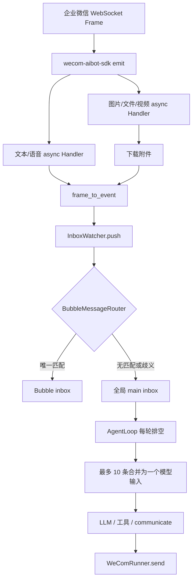
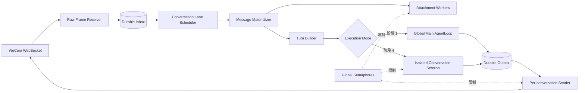
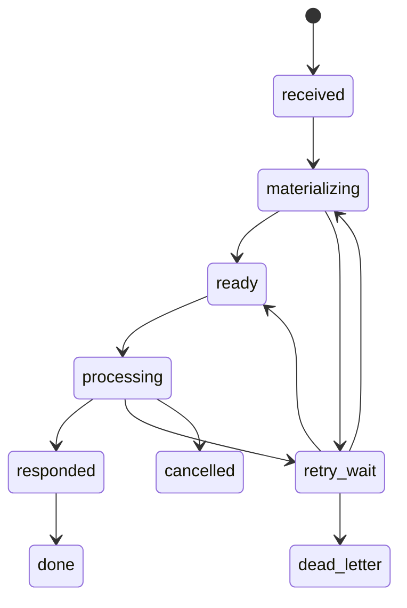

# 企微消息时序、可靠性与并发控制设计

中文 · [English](wecom-message-ordering-and-concurrency.en.md)

[← 返回通信与客户端](README.md)

> 状态：**提案**
>
> 适用范围：企业微信入站、Agent 调度、Bubble 转交、企业微信出站
>
> 目标版本：分阶段落地，不要求一次性替换现有主循环

## 1. 摘要与设计决策

当前企业微信消息会进入内存 `asyncio.Queue`，主 AgentLoop 串行消费，复杂任务还可以派生 Bubble 并发执行。这套机制能够工作，但它只保证“完成预处理后进入同一个队列的顺序”，不能保证企业微信原始消息顺序，也没有消息幂等、持久化积压、精确回复关联和同会话出站串行。

本设计选择以下目标模型：

1. **同一企微会话严格有序**：一个会话同一时间最多处理一个 Turn。
2. **不同会话受控并发**：附件预处理、独立会话执行和发送可以并行，但都受全局上限保护。
3. **先登记、后做慢操作**：收到 Frame 时先持久化顺序和身份，再下载附件，避免图片消息被后发文本超越。
4. **至少一次接收、业务上有效一次**：允许上游重试，通过 `msgid` 唯一约束和状态机避免重复执行、重复回复。
5. **回复关联具体入站消息**：回复使用当前 Turn 的 `reply_context`，不再依赖“这个 chat 最近一次 Frame”。
6. **每个会话拥有单独出站 Lane**：同一回复的文本分片和附件不可被其他消息插入。
7. **分阶段演进**：先修复企微接入层的顺序和幂等，再引入持久队列，最后才并发执行多个 Agent 会话。

推荐的核心抽象是：

> **Conversation Lane（按会话有序的邮箱） + Global Semaphore（跨会话并发上限） + Durable Inbox/Outbox（可恢复收发状态）**

---

## 2. 背景与当前实现

### 2.1 当前入站链路



相关实现：

| 环节 | 当前代码 | 当前语义 |
|---|---|---|
| SDK Handler 注册 | `src/coworker/channels/wecom/runner.py` | 文本、附件等事件分别注册异步 Handler |
| Frame 转事件 | `src/coworker/channels/wecom/adapter.py` | 生成 `IncomingEvent`，时间戳取本地转换时间 |
| 主 Inbox | `src/coworker/agent/inbox_watcher.py` | 无界内存 `asyncio.Queue` |
| 主循环批处理 | `src/coworker/agent/loop.py` | 排空队列，最多取 `inbox_batch_max` 条合并 |
| Bubble 路由 | `src/coworker/agent/bubble_router.py` | 唯一匹配时进入 Bubble，否则回主线 |
| Bubble 并发 | `src/coworker/agent/bubble.py` | 全局 `bubble_max_concurrent`，默认 5 |
| 企业微信发送 | `src/coworker/channels/wecom/runner.py` | 每个 chat 只缓存一个最新 Frame，首次发送消费该 Frame |

### 2.2 当前已经具备的时序保护

以下能力应保留：

- 主 AgentLoop 自身只有一个执行任务，不会并发修改主短期上下文。
- 同一轮主线工具调用按顺序执行。
- `asyncio.Queue` 对已经完成 `put` 的事件保持 FIFO。
- Bubble 只有在绑定关系唯一时才接管消息；多个候选时安全回退主线。
- Bubble 结果经主 Inbox 在下一轮合并，不在正在执行的工具调用中间修改上下文。
- Bubble 收尾时会把未消费的外部消息送回主 Inbox，避免收尾窗口静默丢消息。
- Bubble 创建和续跑受全局并发数量限制。

这些保护主要解决单进程内的结构完整性，并不等价于企业微信端到端顺序保证。

### 2.3 当前缺口

#### 缺口 A：附件导致入站乱序

SDK 会把异步 Handler 调度为独立 Task。图片 A 需要先下载，后发文本 B 可以先完成并进入 Inbox：

```text
企业微信发送：A(图片) → B(请分析这张图)
当前可能入队：B → A
```

#### 缺口 B：回复关联到“最新 Frame”而不是“当前 Turn”

当前 `_frame_cache` 以 `chat_id` 为 Key。A、B 连续到达后，B 会覆盖 A 的 Frame；处理 A 时可能拿 B 的 Frame 调 `reply_stream`。

#### 缺口 C：没有企微消息幂等

Frame 的 `msgid` 没有进入 `IncomingEvent`，也没有唯一索引。重连重推或上游重试会造成重复处理。

#### 缺口 D：主队列不持久且没有背压

未处理消息只存在进程内；崩溃会丢失，持续积压会无限增长。没有 `queued / processing / failed` 状态、租约或死信。

#### 缺口 E：跨参与者混批

主循环一次排空所有事件，并把前 `inbox_batch_max` 条合并为一个 user message。不同用户、单聊和群聊可能被送进同一次模型调用。

#### 缺口 F：对话隔离没有进入主执行路径

`ConversationThread` 类型和 `ShortTermMemory.threads` 已存在，但主消息处理仍写入共享 `short_term.primary`。当前隔离主要依赖消息头中的 `participant_id` 和模型提示词，而不是独立会话执行上下文。

#### 缺口 G：出站没有 per-chat 串行

主线、Bubble、接管通知和长消息分片都可能同时调用 `WeComRunner.send()`；同一个 chat 没有锁或发送 Worker，多个逻辑回复可能交错。

---

## 3. 目标与非目标

### 3.1 目标

- 保证同一 `conversation_key` 的入站消息按首次接收顺序进入 Agent Turn。
- 不让附件下载改变消息相对顺序。
- 对同一企微 `msgid` 最多产生一次业务 Turn 和一次逻辑回复。
- 重启后恢复尚未完成的入站和出站消息。
- 同一会话一个 Turn 在途，不同会话按配置并发。
- 保证单个逻辑回复的文本分片和附件连续发送。
- 明确普通追加、合并、取消和中断语义。
- 让管理员能观察积压、延迟、重试、失败和每个会话当前状态。
- 保持现有 Bubble 的任务并行能力，并让 Bubble 归属于确定的会话。

### 3.2 非目标

- 不承诺跨不同企微会话的全局业务顺序。
- 不追求分布式多节点强一致；当前目标是单实例、本地优先部署。
- 不宣称网络层严格 Exactly Once。目标是 At-least-once 接收配合幂等，达到业务上的 effectively-once。
- 第一阶段不并发调用共享的主 `AgentLoop`，避免并发修改 `short_term.primary`。
- 不把企业微信用户身份等同于权限或租户边界。

---

## 4. 核心不变量

实现和测试必须共同维护以下不变量：

1. **入站唯一性**：`(channel, account_id, source_message_id)` 唯一。
2. **会话有序性**：同一 `conversation_key` 只有最小未完成序号可以被 Claim。
3. **单会话单在途**：同一会话最多一个处于 `processing` 的 Turn。
4. **慢操作不改序**：附件完成顺序不影响 `arrival_seq`。
5. **不跨会话合批**：一个 Agent Turn 只包含一个 `conversation_key`。
6. **回复可追溯**：每条出站消息关联 `turn_id` 和一个明确的 `reply_context`。
7. **同会话出站有序**：同一会话的 `outbound_seq` 严格递增，单个逻辑回复的分片不可交错。
8. **Claim 可恢复**：Worker 崩溃后，过期租约可以重新 Claim。
9. **成功后不重做副作用**：已完成 Turn 的重放只能返回已有结果或保持静默，不能重复执行工具。
10. **队列有限且可观察**：达到容量时必须背压、降级或告警，不能无界吞入内存。

---

## 5. 目标架构



### 5.1 组件职责

#### Raw Frame Receiver

- SDK Handler 中只做校验、提取最小元数据和持久化。
- 不下载附件，不调用模型，不等待业务处理。
- 为首次接收分配单调递增的 `arrival_seq`。
- 对 `msgid` 做幂等插入。

#### Durable Inbox

- 保存消息原始身份、顺序、状态、重试和回复关联信息。
- 推荐 SQLite WAL；符合 Coworker 单机、本地优先定位。
- 数据库写成功代表系统已经接管该消息。

#### Conversation Lane Scheduler

- 按 `conversation_key` 组织有序邮箱。
- 一个 Lane 只有一个 Worker/Actor。
- 不同 Lane 通过全局 Semaphore 并行。
- 只 Claim 每个 Lane 的队首可执行消息。

#### Message Materializer

- 把原始 Frame 转换成模型可见内容。
- 下载附件并生成 `AttachmentData`。
- 附件可在一条消息内部并行下载，但该消息没有 Ready 前，后续消息不能越过它进入 Turn。

#### Turn Builder

- 只合并同一个 Lane 的连续消息。
- 支持短暂安静窗口，吸收用户连续输入。
- 生成稳定的 `turn_id`、消息 ID 列表和 `reply_context`。

#### Executor

- 阶段 1 仍然交给单一主 AgentLoop，先获得顺序和可靠性收益。
- 后续通过独立 Conversation Session 实现跨会话 LLM 并发。
- 所有并发执行必须使用隔离的短期上下文，不能并发写共享 `short_term.primary`。

#### Durable Outbox / Sender

- Agent 先提交逻辑回复到 Outbox，再由发送 Worker 投递。
- 同一会话只有一个 Sender。
- Sender 负责分片、媒体上传、重试和最终状态。

---

## 6. 标识与数据模型

### 6.1 Conversation Key

建议使用稳定、不可歧义的内部 Key：

```text
单聊：wecom:{bot_id}:single:{userid}
群聊：wecom:{bot_id}:group:{chatid}
```

对外继续使用现有 `participant_id`：

```text
wecom:single:{userid}
wecom:group:{chatid}
```

两者区别：

- `participant_id` 是通信地址，供模型和 `communicate` 使用。
- `conversation_key` 是调度与持久化主键，必须包含企微机器人账号，避免多 Bot 冲突。

企微当前不支持通用 `conversation_id` 参数，因此内部 Lane 不应依赖该字段。

### 6.2 入站 Envelope

建议新增独立于模型消息的 Channel Envelope：

```python
@dataclass(frozen=True)
class ChannelEnvelope:
    id: str
    channel: str                    # "wecom"
    account_id: str                 # bot_id
    source_message_id: str          # body.msgid
    conversation_key: str
    participant_id: str
    sender_id: str                  # 群聊中的实际 userid
    chat_type: str                  # single / group
    received_at: datetime           # 本进程首次观察时间
    source_timestamp: datetime | None
    arrival_seq: int                # 本地持久化顺序
    payload: dict                   # 受控保存的原始/规范化 Frame
    reply_context: dict             # req_id、msgid、可回复 Frame 信息
```

`IncomingEvent` 可以增加以下字段，或由 Envelope 物化得到：

```python
source_message_id: str | None
conversation_key: str | None
received_at: datetime | None
source_timestamp: datetime | None
arrival_seq: int | None
turn_id: str | None
reply_context_id: str | None
```

### 6.3 状态机

入站状态：



语义：

| 状态 | 含义 |
|---|---|
| `received` | 原始身份和顺序已持久化 |
| `materializing` | 正在下载附件或规范化内容 |
| `ready` | 可构建 Turn，等待会话 Lane |
| `processing` | 已被 Executor Claim |
| `responded` | 回复已提交 Durable Outbox |
| `done` | 不需要回复，或所有必要出站已完成 |
| `retry_wait` | 可重试错误，等待退避 |
| `dead_letter` | 超过重试上限，需要人工处理 |
| `cancelled` | 被确定性取消，保留审计记录 |

### 6.4 SQLite 建议 Schema

以下是逻辑结构，不要求字段名一次定死：

```sql
CREATE TABLE channel_inbox (
    id TEXT PRIMARY KEY,
    channel TEXT NOT NULL,
    account_id TEXT NOT NULL,
    source_message_id TEXT NOT NULL,
    conversation_key TEXT NOT NULL,
    participant_id TEXT NOT NULL,
    sender_id TEXT NOT NULL,
    arrival_seq INTEGER NOT NULL,
    received_at TEXT NOT NULL,
    source_timestamp TEXT,
    payload_json TEXT NOT NULL,
    reply_context_json TEXT,
    state TEXT NOT NULL,
    attempt_count INTEGER NOT NULL DEFAULT 0,
    lease_owner TEXT,
    lease_until TEXT,
    next_attempt_at TEXT,
    last_error TEXT,
    turn_id TEXT,
    created_at TEXT NOT NULL,
    updated_at TEXT NOT NULL,
    UNIQUE(channel, account_id, source_message_id),
    UNIQUE(arrival_seq)
);

CREATE INDEX idx_inbox_lane_head
ON channel_inbox(conversation_key, state, arrival_seq);

CREATE TABLE channel_outbox (
    id TEXT PRIMARY KEY,
    turn_id TEXT NOT NULL,
    conversation_key TEXT NOT NULL,
    participant_id TEXT NOT NULL,
    outbound_seq INTEGER NOT NULL,
    reply_context_json TEXT,
    message TEXT NOT NULL,
    attachments_json TEXT NOT NULL,
    state TEXT NOT NULL,
    attempt_count INTEGER NOT NULL DEFAULT 0,
    next_attempt_at TEXT,
    last_error TEXT,
    created_at TEXT NOT NULL,
    updated_at TEXT NOT NULL,
    UNIQUE(conversation_key, outbound_seq)
);
```

序号应在同一个数据库事务内分配。单实例可以用 SQLite 自增主键作为全局 `arrival_seq`；业务上只依赖每个 Lane 内的相对顺序。

---

## 7. 入站顺序与幂等

### 7.1 Handler 必须快速返回

现有 `_on_with_attachments()` 在入队前下载文件，应改为：

```python
async def _on_message(frame):
    envelope = normalize_minimal(frame)
    result = await durable_inbox.insert_if_absent(envelope)
    ingress_wakeup.set()
    return result
```

慢操作由后台 Materializer 完成。

### 7.2 幂等键

首选：

```text
(channel="wecom", account_id=bot_id, source_message_id=body.msgid)
```

如果极少数事件缺少 `msgid`：

- 不要把当前时间放进幂等键。
- 使用 `req_id + chat_id + msgtype + 规范化 payload hash` 作为降级键。
- 记录 `dedupe_key_source=fallback`，便于监控。

重复消息处理规则：

| 原记录状态 | 重复到达行为 |
|---|---|
| `received` 到 `processing` | 更新 `last_seen_at`，不再排队 |
| `responded` / `done` | 静默确认，不重复执行和回复 |
| `retry_wait` | 不绕过退避；仅更新观测信息 |
| `dead_letter` | 记录重复次数，是否重开由管理员显式决定 |

### 7.3 顺序定义

系统保证的是：

> 同一实例首次成功持久化每条消息的顺序。

如果企业微信提供可信服务端时间或序号，可保存用于审计，但不能仅依赖时间戳排序，因为时间精度、时钟和重推都会制造歧义。

---

## 8. 附件物化

### 8.1 Head-of-line 行为

同一会话中，消息 A 的附件尚未完成时，消息 B 可以被接收和持久化，但不能越过 A 进入 Agent Turn。

这是有意选择：

- 优点：语义顺序正确。
- 代价：一个慢附件会阻塞该会话。
- 不影响其他会话，它们由独立 Lane 继续处理。

### 8.2 超时与失败

建议配置：

- 单附件下载超时。
- 单消息总物化超时。
- 附件下载全局并发上限。
- 指数退避和最大尝试次数。

达到重试上限后有两种策略：

1. **严格策略（默认）**：进入 `dead_letter`，该 Lane 暂停并告警，防止后续消息失去上下文。
2. **降级策略**：生成“附件下载失败”的占位内容，将消息标记为带警告的 `ready`，允许 Lane 继续。

建议图片、文件默认使用降级策略，但必须在模型内容和日志中明确附件缺失；安全或业务关键场景可以选择严格策略。

---

## 9. Turn 构建与批处理

### 9.1 禁止跨会话批处理

当前 `get_pending()` 排空全局队列再切前 N 条的方式应替换为 Lane Head 选择。一个 Turn 必须满足：

```text
所有消息 conversation_key 相同
arrival_seq 严格递增
所有消息 state=ready
```

### 9.2 同会话合批

为了符合用户连续输入习惯，可以设置短暂安静窗口：

```text
quiet_window_ms = 400~800ms
max_messages_per_turn = 10
max_turn_wait_ms = 1500ms
```

规则：

- 第一条 Ready 后启动安静窗口。
- 窗口内同 Lane 新消息可以合并。
- 附件未 Ready 的消息构成边界，不能跳过。
- 明确的取消/中断命令不与普通消息合并。
- 达到条数或最大等待时间立即构建 Turn。

### 9.3 Reply Context 选择

一批消息对应一个逻辑回复时，默认使用批次最后一条可回复消息的 Frame 作为 `reply_context`，并在 Turn 中保留全部 `source_message_id`。

如果业务要求逐条确认，应生成多个 Outbox 项，而不是让发送层猜测。

---

## 10. 执行并发模型

### 10.1 阶段 1：主 Agent 继续全局串行

首先只改变接入和调度：

```text
多个 Conversation Lane 有序积压
        ↓
公平调度器每次选择一个 Ready Turn
        ↓
现有 AgentLoop 串行执行
```

收益：

- 消息不乱序、不混批、可去重、可恢复。
- 不需要立即重构主短期记忆和模型循环。

限制：

- 不同用户仍共享一个主执行槽。
- 一个长任务会增加其他会话等待时间。

### 10.2 阶段 4：隔离会话并发执行

真正跨会话并发前，必须引入 `ConversationSession`：

```python
class ConversationSession:
    conversation_key: str
    participant_id: str
    short_term: ShortTermMemory
    mailbox: OrderedMailbox
    active_turn_id: str | None
```

每个 Session：

- 共享 Identity、System Prompt、Skill、Palace 和长期记忆服务。
- 拥有独立短期对话上下文，防止跨用户泄漏。
- 一个 Session 内串行。
- 不同 Session 通过 `conversation_max_concurrent` Semaphore 并发。

不允许多个 Session 直接并发写同一个 `short_term.primary`。需要全局自我活动流时，应使用独立主线程或结构化事件汇总，而不是共享可变消息列表。

### 10.3 公平性

调度建议采用 Round Robin 或 oldest-lane-first，而不是永远选择全局最旧消息：

- 同 Lane 保证 FIFO。
- Lane 之间轮转，防止高流量群聊饿死其他单聊。
- 可增加 `max_consecutive_turns_per_lane`，默认 1。
- 系统消息和管理员指令可以拥有受控优先级，但不能插到同一会话已 Claim Turn 的中间。

---

## 11. 新消息、取消与中断语义

系统应区分四种行为：

| 类型 | 默认行为 |
|---|---|
| 普通消息 | `append`，排在当前 Turn 后 |
| 短时间连续补充 | `coalesce`，仅在当前 Turn 尚未开始时合并 |
| 明确取消 | `cancel`，请求取消当前可取消任务 |
| 高优先级修正 | `interrupt`，在安全检查点注入，不强杀不可回滚工具 |

### 11.1 安全检查点

新消息不能任意插入 LLM 请求或工具执行中间。可检查的位置：

- LLM 调用开始前。
- 一组工具调用全部完成后。
- Bubble 每轮开始前。
- 后台代码任务返回后。

### 11.2 取消

- 尚未 Claim 的 Turn 可以直接标记 `cancelled`。
- 正在思考的 LLM 请求可在 Provider 支持且不会破坏上下文时取消。
- 已开始的外部副作用工具不能假定可回滚；应先完成/确认状态，再向用户说明。
- “停止”“取消”是否触发控制语义应由明确命令或 UI 元数据决定，不建议仅靠模型自由判断。

---

## 12. Bubble 集成

Bubble 是任务并行单元，不应承担基础消息队列职责。

### 12.1 归属

新增或明确：

```text
bubble.owner_conversation_key
bubble.owner_turn_id
bubble.participant_id
bubble.conversation_id（通道支持时）
```

### 12.2 路由约束

- 同一 `conversation_key` 默认最多一个“接管通信”的活跃 Bubble。
- 非通信 Bubble 不占用会话接管槽。
- 如果存在多个候选，不应长期回退到共享主线；应记录冲突并阻止创建第二个接管 Bubble。
- Bubble inbox 仍按 Lane 顺序接收后续消息。

### 12.3 收尾顺序

建议为每个 Lane 定义统一序号：

```text
Bubble 最终直接回复（如有）
→ Bubble 结束通知
→ Bubble 结果写回 Session
→ 收尾窗口收到的用户消息
```

所有步骤通过同一个会话 Outbox/Lane 排序，避免主线和 Bubble 同时调用企微 Sender。

### 12.4 并发配额

`bubble_max_concurrent` 与 `conversation_max_concurrent` 分开：

- Conversation 配额控制同时服务多少外部会话。
- Bubble 配额控制内部并行子任务。
- 可增加全局 LLM Semaphore，防止两类并发叠加后突破 Provider 限流。

---

## 13. 出站顺序与精确回复关联

### 13.1 删除“每个 chat 只有一个最新 Frame”的语义

替代方案：

- Durable Inbox 为每个入站消息保存 `reply_context`。
- Turn 明确选择 `reply_context_id`。
- Outbox 项携带该上下文。
- Sender 只消费 Outbox 指定的 Frame/令牌。

Frame 过期时，Sender 回退到主动 `send_message`，但仍保持同一 Lane 的发送顺序。

### 13.2 单逻辑回复原子发送

Outbox 中一个逻辑回复可以包含：

```python
OutboundMessage(
    message="...",
    attachments=[...],
    reply_context=...,
)
```

Sender 在持有该 Lane 的发送权时依次完成：

1. 文本分片。
2. 媒体上传。
3. 媒体发送。
4. 状态提交。

另一个逻辑回复不能插入这些步骤之间。

### 13.3 出站幂等

如果企业微信发送接口没有幂等键，崩溃发生在“远端已成功、本地未提交”时，无法完全消除重复发送。缓解方式：

- 给 Outbox 项稳定 ID。
- 尽可能把稳定 `req_id`/幂等标识传给 SDK。
- 发送前后记录 attempt。
- 对不确定结果标记 `delivery_unknown`，不要无限自动重试。
- 管理页提供人工确认“重发/标记完成”。

---

## 14. 背压、限流与资源边界

建议独立配置以下上限：

```env
WECOM__INGRESS_QUEUE_MAX=1000
WECOM__MATERIALIZE_MAX_CONCURRENT=4
WECOM__ATTACHMENT_DOWNLOAD_TIMEOUT_SECONDS=30
WECOM__MESSAGE_MATERIALIZE_TIMEOUT_SECONDS=60
WECOM__SEND_MAX_CONCURRENT=4
WECOM__MAX_ATTEMPTS=5
WECOM__RETRY_BASE_SECONDS=2

AGENT__CONVERSATION_MAX_CONCURRENT=4
AGENT__CONVERSATION_MAX_PENDING_PER_LANE=100
AGENT__CONVERSATION_QUIET_WINDOW_MS=600
AGENT__CONVERSATION_MAX_MESSAGES_PER_TURN=10
AGENT__LLM_MAX_CONCURRENT=6
```

说明：

- 持久 Inbox 是主要缓冲区，内存队列只保存待唤醒 Key 或有限任务。
- 达到单 Lane 上限时，应对该会话告警或发送忙碌提示，不能影响其他 Lane。
- 达到磁盘或全局上限时，停止继续建立无限 Handler Task，并产生高优先级运维告警。
- Provider 的并发和速率限制必须在 Agent/Bubble 之上再设全局门控。

---

## 15. 可观测性与管理界面

### 15.1 指标

至少记录：

- `wecom_inbound_received_total`
- `wecom_inbound_duplicate_total`
- `wecom_inbound_dead_letter_total`
- `wecom_inbox_depth`
- `wecom_lane_depth{conversation}`（展示时脱敏）
- `wecom_oldest_pending_seconds`
- `wecom_materialize_seconds`
- `wecom_turn_wait_seconds`
- `wecom_turn_processing_seconds`
- `wecom_outbox_depth`
- `wecom_send_retry_total`
- `wecom_delivery_unknown_total`
- `conversation_active_count`
- `conversation_queue_saturation_total`

### 15.2 日志关联字段

从接收到发送，全链路携带：

```text
source_message_id
conversation_key_hash
arrival_seq
turn_id
bubble_id（可选）
outbox_id
attempt
state_from / state_to
```

原始 `userid`、`chatid` 和消息正文遵循现有日志脱敏与数据边界约定。

### 15.3 管理能力

管理页建议提供：

- 按状态查看 Inbox/Outbox。
- 查看每个 Lane 的队首、长度、活跃 Turn 和等待时长。
- 对死信执行“重试”“跳过并继续”“标记完成”。
- 对 `delivery_unknown` 执行人工重发或确认。
- 暂停/恢复某个 Lane。
- 查看 Bubble 对某个 Lane 的接管状态。

---

## 16. 安全与数据保留

持久化原始 Frame 会扩大本地敏感数据范围，应遵循[数据与信任边界](../architecture/data-boundaries.md)：

- 只保存恢复处理所需字段，不长期保留无关 Header。
- Secret、鉴权信息不得进入 payload。
- 已完成 Inbox/Outbox 设置可配置保留期，例如 7 天。
- 附件继续使用随机化文件名，并记录归属消息和清理时间。
- 管理 API 不直接返回完整原始 Frame；默认返回脱敏摘要。
- SQLite 文件和附件目录沿用本机可信边界，不对公网暴露。

---

## 17. 代码落点建议

建议按职责拆分，避免继续扩大 `WeComRunner`：

```text
src/coworker/channels/wecom/
├── adapter.py              # Frame 规范化，不负责调度
├── runner.py               # 连接生命周期、Handler 注册
├── envelope.py             # ChannelEnvelope / conversation key
├── inbox_store.py          # SQLite durable inbox
├── materializer.py         # 附件和 IncomingEvent 物化
├── scheduler.py            # Conversation Lane 调度
├── outbox_store.py         # durable outbox
└── sender.py               # per-conversation 有序发送

src/coworker/agent/
├── conversation.py         # Session / Turn 数据结构
├── conversation_scheduler.py
└── loop.py                 # 阶段 1 保持兼容，后续抽出 turn executor
```

通用能力如果后续被 Desktop/REST 复用，可再上移到：

```text
src/coworker/channels/base/
```

第一版不要为了“通用”提前抽象所有信道；先让 WeCom 的顺序语义稳定并有测试，再提炼接口。

---

## 18. 分阶段实施计划

### 阶段 0：行为测试先行

在不改生产行为前增加可复现测试：

- 延迟图片下载，证明当前文本会越过图片。
- 同一 chat 连续 A/B，证明 Frame 缓存被 B 覆盖。
- 重复 `msgid` 被处理两次。
- 主线与 Bubble 分段发送交错。
- 多 participant 被合并进同一批次。

### 阶段 1：内存版有序 Lane

- 增加 `source_message_id`、`conversation_key`、`arrival_seq`、`reply_context`。
- Handler 先登记原始消息，再异步物化。
- 同一 Lane 单 Worker。
- 禁止跨 Lane 合批。
- per-chat 出站 Lock/Queue。
- 用 `msgid` 做进程内 TTL 去重。

该阶段快速解决主要正确性问题，但重启仍会丢积压。

### 阶段 2：Durable Inbox

- 引入 SQLite WAL、状态机、租约、重试和死信。
- 启动时恢复非终态消息。
- 增加容量和积压指标。
- 删除依赖无界内存队列承载业务消息的路径。

### 阶段 3：Durable Outbox 与精确 Frame

- `CommunicateRequest` 或通道上下文支持 `reply_context_id`。
- Outbox 持久化逻辑回复。
- 每个 Lane 单 Sender，回复分片原子发送。
- 处理 `delivery_unknown`。

### 阶段 4：Conversation Session

- 把主执行接口从“读取全局 Inbox”重构为“执行一个 Turn”。
- 每个会话独立短期上下文。
- 通过全局 Semaphore 开启跨会话并发。
- 重新定义全局自我活动与会话上下文的汇总关系。

### 阶段 5：中断与管理产品化

- 结构化 cancel/interrupt。
- 管理页队列、死信和 Lane 控制。
- 忙碌提示、排队位置和积压告警。

---

## 19. 测试矩阵

| 场景 | 期望 |
|---|---|
| 同一会话：图片 A 下载慢，文本 B 后到 | Agent 仍看到 A → B |
| 不同会话：A 下载慢，B 为文本 | B 不受 A 阻塞 |
| 同一 `msgid` 回调两次 | 只生成一个 Inbox 记录和一个 Turn |
| 进程在 `ready` 状态崩溃 | 重启后继续处理 |
| 进程在租约持有期间崩溃 | 租约过期后重新 Claim |
| 进程在 Outbox 未发送前崩溃 | 重启后发送 |
| 发送成功但本地提交前崩溃 | 标记/检测不确定投递，不无限重试 |
| 同一会话两条长回复 | 每条内部连续，不发生分片交错 |
| 主线与 Bubble 同时回复同一会话 | 统一进入同一 Outbox 顺序 |
| 两个 Bubble 请求绑定同一会话 | 第二个接管请求被拒绝或显式冲突 |
| 10 个会话同时到达 | 不超过配置并发，Lane 内顺序不变 |
| 高流量群聊持续输入 | 其他 Lane 仍能获得执行机会 |
| 单 Lane 达到上限 | 只限制该 Lane，并产生告警 |
| 附件永久下载失败 | 按配置降级或死信，行为可观察 |
| 取消尚未执行的 Turn | 标记 cancelled，不调用模型/工具 |
| 工具产生外部副作用时收到取消 | 在安全检查点处理，不伪装已回滚 |

除单元测试外，建议增加使用 Fake WeCom Client 的确定性集成测试，主动控制下载、发送和崩溃时点。

---

## 20. 验收标准

第一阶段上线至少满足：

- [ ] 同一企微会话 100% 通过乱序附件测试。
- [ ] 重复 `msgid` 不重复进入 Agent。
- [ ] 不同 participant 不再进入同一个模型批次。
- [ ] 回复使用当前 Turn 的 Frame，而不是 chat 最新 Frame。
- [ ] 同一 chat 的两个逻辑回复不会分片交错。
- [ ] 所有新增队列都有容量配置和积压日志。

完整方案完成后还应满足：

- [ ] 重启恢复所有非终态 Inbox/Outbox。
- [ ] 同一会话任意时刻最多一个 processing Turn。
- [ ] 不同会话并发不共享可变短期上下文。
- [ ] Bubble 和主线通过统一 Outbox 排序。
- [ ] 管理员可以处理死信和不确定投递。
- [ ] 压力测试下没有无界 Task、队列或内存增长。

---

## 21. 待确认决策

实现前需要产品和工程共同确认：

1. 附件最终失败时默认“降级继续”还是“阻塞 Lane 进入死信”？
2. 连续消息合批的安静窗口默认值是多少？
3. 第一阶段是否需要向用户返回“已排队/正在处理”的可见提示？
4. 明确取消命令由固定文本、企微卡片事件还是模型识别触发？
5. 完成消息和附件的默认保留时间是多少？
6. 发送结果不确定时，默认停止等待人工处理还是自动再试一次？
7. Conversation Session 上线后，全局主线如何获得跨会话的低敏摘要，而不泄漏具体对话？
8. 潜意识 Bubble 是否与用户任务 Bubble 共用并发配额，还是拥有独立保留容量？

在这些问题确认前，可以先实施阶段 0 和阶段 1；它们不依赖最终的多会话上下文产品决策。
