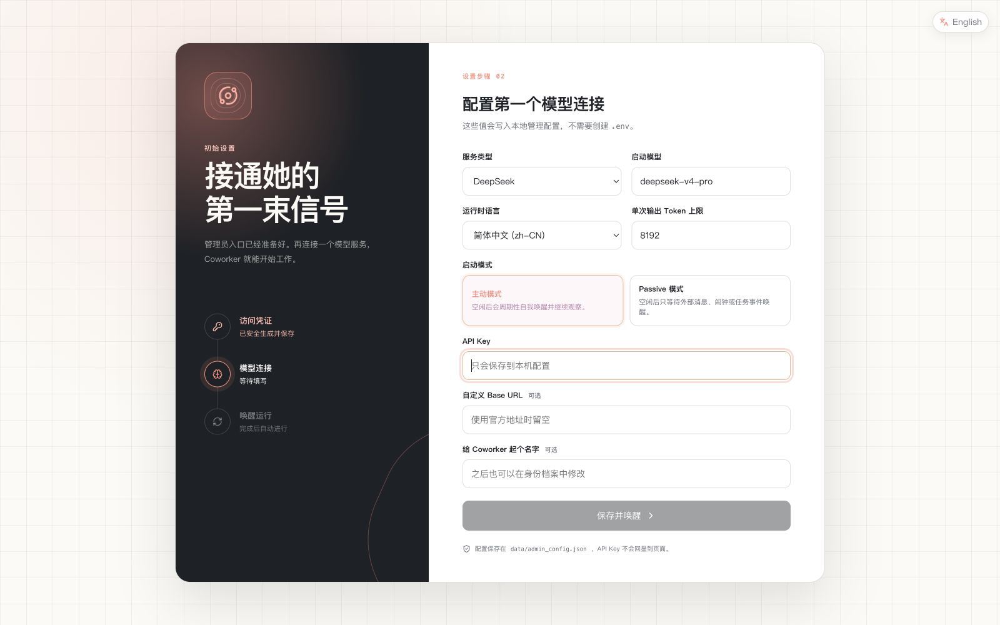

# 首次运行

中文 · [English](README.en.md)

[← 返回文档索引](../README.md)

本页把安装运行时、完成管理端初始化、验证服务和选择客户端串成一条完整路径。完成后你会
得到一个只监听本机、已经配置模型且可以接收消息的 Coworker 实例。

## 1. 选择运行方式

| 方式 | 适合 | 主要要求 |
|---|---|---|
| 直接运行 Docker 镜像 | 最快完成首次体验 | Docker；镜像已包含源码与运行依赖 |
| 源码运行 | 开发和修改代码 | Python 3.13+、uv；浏览器工具需要 Chromium |
| Docker Compose + 当前 checkout | 在镜像执行环境中运行本地源码 | Docker；需要先克隆仓库 |
| Desktop | 本机协作工作台 | 仍需先有独立运行的 Coworker 服务 |

完整操作系统、CPU 架构、Desktop 制品和协议说明见
[平台支持与组件兼容](platform-support.md)。

Coworker Desktop 不是 Coworker 服务的安装器。它连接已经运行的实例，并把 Local、Codex
和 Claude Code 会话接入 Coworker。

Intel macOS 无法安装当前 PyTorch wheel。请使用
[Dev Container](../development/development.md#dev-container) 或 Docker 路径运行
Coworker 服务；Desktop 本身仍可使用与 Intel macOS 匹配的安装包。

## 2. 启动 Coworker

下面三种服务启动方式选择一种即可。

### 直接运行 Docker 镜像（推荐首次使用）

```bash
docker run --name coworker \
  -p 127.0.0.1:8000:8000 \
  -e API__HOST=0.0.0.0 \
  ghcr.io/virtualbeingsresearch/coworker:offline
```

不需要克隆仓库。镜像已经包含 Coworker 源码、Python 环境、Chromium、FFmpeg 和
embedding 模型，Docker 会自动为 Git 工作区、运行状态和模型缓存创建数据卷。命令会留在
前台显示管理员令牌与日志，按 `Ctrl+C` 停止后可用 `docker start -a coworker` 再次启动
同一个容器。准备长期运行时，改用[长期运行与部署](../operations/deployment.md#docker-compose--当前-checkout)
中的 Compose 配置，以便明确管理卷、重启策略和备份。

### 从源码运行

```bash
git clone https://github.com/VirtualBeingsResearch/CoWorker.git
cd CoWorker
uv sync
uv run playwright install chromium
uv run coworker
```

也可以使用 `uv run python -m coworker`。首次体验不需要预先创建 `.env`。

### 在镜像执行环境中运行当前 checkout

```bash
git clone https://github.com/VirtualBeingsResearch/CoWorker.git
cd CoWorker
docker compose up --pull always --no-build
```

发布镜像提供 Linux、Python、Chromium、FFmpeg 和预置 embedding 模型，当前 checkout
直接挂载到 `/app`，同时作为实际运行的源码和 Agent 工作区。这样不需要在本机安装 Python
依赖，也不需要为首次运行构建镜像。运行状态和模型缓存保存在独立命名卷中；源码修改后重启
容器即可，依赖或锁文件变化时再参考[开发指南](../development/development.md#使用-offline-镜像开发)
重建执行环境。

严格离线镜像不会在运行时从 Hugging Face 或 Git 远端补齐内容；你配置的对话模型服务仍
可能需要联网。不要通过删除卷来处理普通启动问题。

启动完成后，默认管理地址为 <http://127.0.0.1:8000/admin>。以上 Docker 命令只把宿主机
入口绑定到 `127.0.0.1:8000`，源码运行时 API 默认也只监听 `127.0.0.1`。不要将 `8000`
端口直接映射到公网。

## 3. 取得管理员令牌

如果还没有管理员令牌，第一次启动会：

1. 生成一个随机令牌；
2. 在终端显示当前有效令牌；
3. 将它保存到 `data/admin_config.json`。

打开管理地址并输入该令牌。它可以读取和修改运行设置，不应发送到聊天、提交到 Git 或
保存在共享文档中。配置文件中的令牌和模型 API Key 依赖操作系统权限与磁盘加密保护。

## 4. 完成初始化向导

初始化未完成时，Coworker 只启动管理 HTTP 服务，不启动 Agent 主循环、消息轮询或外部
Channel。按向导完成：

1. 选择运行时语言；
2. 设置单次输出 Token 上限；
3. 选择 Provider 和启动模型；
4. 输入对应 API Key 与 Base URL（如需要）；
5. 选择是否启用 Passive mode；
6. 检查摘要后保存。



<p align="center"><sub>首次初始化向导 · 配置运行语言、Provider 与启动模型。</sub></p>

推荐模型目录中的模型已经声明工具调用能力。手动输入目录外模型时，需要确认模型和 API
网关支持 tool/function calling；向导不会发起可能计费的能力探测。

保存后 Coworker 会进行一次干净重启。页面短暂断开是正常现象；等待它重新连接，不要连续
重复保存或启动多个进程。

## 5. 确认实例可用

初始化完成并等待页面重新连接后，打开 <http://127.0.0.1:8000/>。在身份主页右下角打开
“与搭档对话”：

1. 首次使用时填写你的显示名称，点击“开始对话”；
2. 发送“你好，你是谁？”；
3. 收到搭档的回复，即可确认前端、消息通道和当前模型都已正常工作。

显示名称用于建立本次浏览器中的连接身份，并不是管理员认证。Web 对话记录只保存在当前
浏览器中；清理浏览器数据或换用其他设备后不会自动同步。

还可以进入[管理后台](../guides/README.md)补充检查：

- “生命总览”不再显示首次设置状态；
- 当前模型和运行状态正确；
- “诊断与审计”没有持续增长的异常任务；
- 终端没有反复出现相同启动错误。

<details>
<summary>无界面环境或排障时，通过 API 验证</summary>

先请求状态：

```bash
curl http://127.0.0.1:8000/status
```

再发送一条消息：

```bash
curl -X POST http://127.0.0.1:8000/messages \
  -H "Content-Type: application/json" \
  -d '{"sender_id": "alice", "content": "你好，你是谁？"}'
```

如果返回鉴权错误，先确认当前接口是否要求通信 token；不要通过暴露或关闭生产鉴权来规避
问题。

</details>

## 6. 完善身份与日常设置

进入[管理后台](../guides/README.md)：

- 在“身份档案”设置姓名、现居地和人格；
- 在“模型编排”检查主线、摘要、视觉和 fallback；
- 在“运行设置”确认记忆、Agent、API 和 Channel 参数；
- 在“能力内容”查看或创建 Skill、Palace 和潜意识模式；
- 在“运行中心”查看任务、闹钟、日志、备份与安全重启。

更改运行时语言、Provider 或某些底层参数后可能需要重启。页面会区分即时生效、需要保存
以及需要重启的设置。

## 7. 选择进入方式

- 日常照看和配置：继续使用 Web 身份主页与管理后台。
- 本机协作 Codex/Claude Code：安装并配置
  [Coworker Desktop](../channels/desktop.md)。
- 程序或自动化接入：使用 [API 与通信入口](../channels/api-and-channels.md)。
- 个人微信接入：使用[微信 Claw](../channels/weixin-claw.md)。
- 公网远程 Desktop：先部署[自托管 Relay](../operations/relay.md)。

## 下一步与恢复

运行数据默认保存在 `data/`，用户能力内容默认保存在 `.coworker/`。开始长期使用前先阅读
[数据与信任边界](../architecture/data-boundaries.md)，并为工作区和运行数据制定备份策略。

若启动、初始化、模型调用或客户端连接失败，先查
[故障排查](../operations/troubleshooting.md)，不要直接删除 `data/`、配置或 Docker 卷。

[← 返回项目首页](../../README.md)
