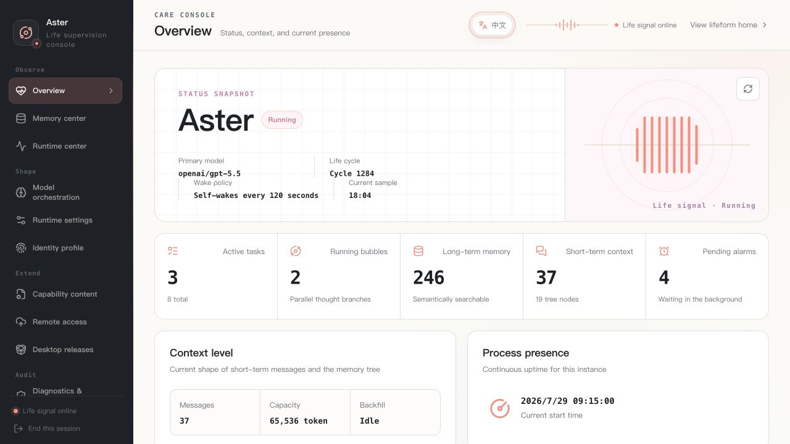

# Web Management Console

[简体中文](README.md) · English

[← Back to the documentation index](../README.en.md)

The Web management console is available at
<http://127.0.0.1:8000/admin> by default. It manages Coworker's runtime,
memory, tasks, models, identity, capability content, remote access, and
diagnostics. It is an administration surface, not a public multi-tenant control
plane.

## Sign-in and security boundary

Sign in with the administrator token printed by the startup terminal. An
automatically generated token is stored in `data/admin_config.json`. It can read
and modify sensitive configuration and perform restart or recovery operations:

- do not commit it, share it in screenshots, or send it through chat;
- do not let untrusted browser extensions read the management page;
- do not expose `/admin` or Coworker's port `8000` directly to the internet;
- prefer a separate `API__COMMUNICATION_TOKEN` for routine Desktop traffic.

The confirmation name displayed by the page comes from the current identity.
Full restore, deletion, restart, and other destructive or state-changing
operations require typing it. This prevents accidental clicks but does not
replace authorization or backups.

## First entry

Before initialization, the console shows only first-time setup. After language,
output-token, Provider, model, and Passive mode settings are saved, Coworker
restarts. See [First Run](../getting-started/README.en.md) for the complete path.

After initialization, the sidebar organizes ten areas under Observe, Shape,
Extend, and Trace.

Life Overview · The screenshot uses isolated synthetic demo data and contains no real users, credentials, or runtime records.

## Observe: understand the current state

### Life Overview

Life Overview shows current state rather than full history:

- whether the Agent is active, resting, or waiting for an event;
- current short-context pressure and memory-tree structure;
- process uptime, current model, and important runtime indicators;
- state shown on the public Web identity page.

A `pending` task often means it is waiting for a message or timer and does not
automatically mean the runtime is stuck. Combine Diagnostics and Audit, logs,
and the last successful activity when deciding whether there is a failure.

### Memory Center

Memory Center contains:

- **Memory spine**: short context compressed across time scales;
- **Current message tail**: recent messages directly visible to the next main
  turn;
- **Pinned context**: important information re-injected after compression;
- **Long-term memory**: searchable, editable, and removable mem0 memories;
- **Parallel-thinking records**: persisted Bubble and subconscious traces;
- **Memory maintenance**: full compression and background backfill from
  persistent logs.

Full compression calls a model and changes short-context structure. Backfill
runs in the background. Confirm the model is available first, and do not run
the offline backfill command at the same time. Removing long-term memory cannot
be undone from the ordinary page, so verify that it is no longer needed.

Pinned context should contain a small amount of stable information that must
remain visible. Pinning large source documents permanently consumes context.

### Runtime Center

Runtime Center brings together:

- task board;
- alarms and waiting;
- lifetime interaction history;
- emergency backups;
- safe restart.

Tasks and alarms share the same data with Coworker's model tools. A change made
on the page is visible the next time the Agent reads them.

Emergency backups recover short-term context after repeated Agent errors:

- **Summary restore** compresses a backup and sends it to the inbox at lower
  token cost without replacing the current context;
- **Full restore** replaces the current short-term context and requires explicit
  confirmation.

These are not disaster backups for all of `data/`, `.coworker/`, or Docker
volumes. Record the current state before a full restore and prefer summary
restore when it can recover enough context.

## Shape: change models, runtime, and identity

### Model Orchestration

This area manages:

- main model;
- summary and compression model;
- vision model;
- fallback chain.

A main-model switch applies to later calls and does not interrupt a call already
in progress. Summary and vision models can use different Providers. Order
fallback entries from first to last and remove Providers that are no longer
valid.

The first real call may incur cost or expose an incompatible model or gateway.
Before changing it, confirm the Provider's data boundary, tool-calling support,
and cost.

### Runtime Settings

Runtime Settings groups model connections, memory, Agent, API, Channel, and
other runtime parameters. The page:

- redacts existing secrets and shows only whether they are configured;
- marks validation errors;
- distinguishes hot updates from restart-required changes;
- provides dedicated management panels for some Channels.

Do not use development mode in place of correct HTTPS or Relay configuration.
See [Configuration and Models](../operations/configuration.en.md) for complete
environment-variable semantics.

### Identity Profile

Identity Profile manages name, current location, and personality. Saving writes
the identity files and refreshes the System Prompt cache, so later reasoning
uses the new identity immediately.

**Current System Prompt** on the same page is the exact read-only cached version.
It excludes tool schemas, short-term context, and the current message. Use it
to verify that identity and system settings entered the prompt, not as a full
request audit.

## Extend: add capabilities and remote entry points

### Capability Content

Capability Content manages:

- **Skills**: callable working methods and procedures;
- **Palaces**: contextual entry points into domain knowledge;
- **Subconscious modes**: background observation and thinking modes.

The editor manages each asset's main Markdown document and supporting files.
Chinese and English prose use companion files; stable metadata and tool names
must not be translated. Before deleting an asset, check whether prompts, other
assets, or routine workflows still reference it.

Review content copied from the Web, messages, or third parties before writing it
into these assets. Skills and Palaces enter model context, so malicious
instructions can become persistent prompt injection.

### Remote Access

Remote Access pairs the current Coworker with a self-hosted Relay. The page can
configure Relay, test the connection, reconnect, and rotate the token. Ordinary
disconnects retry automatically and do not require repeated manual reconnects.

Relay provides a secure Desktop entry point; it is not a general reverse proxy.
See [Self-hosted Relay](../operations/relay.en.md) for deployment, backup,
blocking, and trust boundaries.

### Desktop Releases

Desktop Releases is for release maintainers. It can:

- create a local release draft;
- upload updater artifacts, installers, and signatures;
- synchronize drafts from a compatible GitHub Release source;
- inspect platform coverage and Desktop version distribution;
- publish or roll back `latest.json`.

Creating or synchronizing a draft does not notify clients. Only an explicit
Publish changes the update manifest. An online push asks a client to check a
signed update and does not bypass user confirmation. Ordinary users do not need
this page.

## Trace: diagnostics and audit

Event-loop diagnostics shows background-task state and recent failures.
Administrator Operation Timeline records management-operation metadata without
tokens, secrets, or complete message bodies.

When diagnosing a problem:

1. record when it happened;
2. check whether a background task is failing repeatedly;
3. compare lifetime interaction history and process logs;
4. check whether a recent administrator action changed configuration;
5. restart or restore only after identifying the likely cause.

See [Troubleshooting](../operations/troubleshooting.en.md) for the common
diagnostic order and recovery paths.

## Suggested routine checks

- Confirm runtime state matches your expectation.
- Check for background tasks that fail continuously.
- Review current model, fallback, and unexpected usage.
- Remove tasks, alarms, and recent interactions that are no longer needed.
- Test that backups restore instead of only checking that backup files exist.
- Record the current configuration and version before upgrading or changing a
  Provider, memory model, or Relay.

[← Back to the project home](../../README.en.md)
