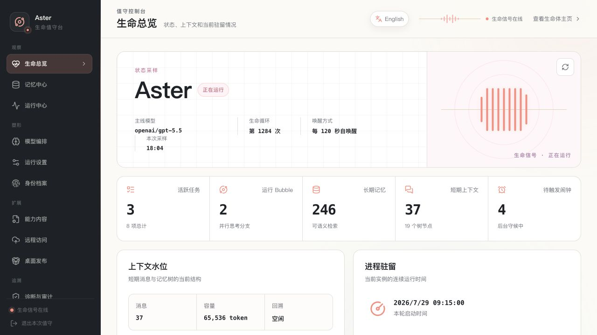

# Web 管理后台

中文 · [English](README.en.md)

[← 返回文档索引](../README.md)

Web 管理后台位于默认地址 <http://127.0.0.1:8000/admin>，用于照看 Coworker 的运行状态、
记忆、任务、模型、身份、能力内容、远程连接和诊断记录。它是管理面，不是面向公网的多租户
控制台。

如果更想从目标而不是页面结构开始，请先看[典型使用场景](use-cases.md)；创建 Skill、
Palace 或潜意识模式时使用[能力内容创作](capability-authoring.md)。

## 登录与安全边界

使用启动终端显示的管理员令牌登录。自动生成的令牌保存在
`data/admin_config.json`。管理员令牌可以读取和修改敏感配置、执行重启与恢复等操作：

- 不要提交、截图分享或发送到聊天；
- 不要让不受信任的浏览器扩展读取管理页面；
- 不要把 `/admin` 或 Coworker 的 `8000` 端口直接暴露到公网；
- Desktop 日常通信优先使用独立的 `API__COMMUNICATION_TOKEN`。

页面显示的确认名称来自当前身份。完整恢复、删除、重启等破坏性或状态改变操作会要求输入
确认名称；这是一道防误操作确认，不替代权限和备份。

## 第一次进入

尚未初始化时，后台只显示首次设置流程。完成语言、输出 Token、Provider、模型和 Passive
mode 设置后保存，Coworker 会重启。详细步骤见[首次运行](../getting-started/README.md)。

初始化完成后，侧边栏按“观察、塑形、扩展、追溯”组织十个功能区。

生命总览 · 查看当前状态、上下文水位、模型与运行指标。

## 观察：了解她现在怎样

### 生命总览

生命总览提供当前状态而不是完整历史：

- Agent 是活跃、休息还是等待事件；
- 当前短期上下文水位和记忆树结构；
- 进程连续运行时间、当前模型和重要运行指标；
- Web 身份主页可见的当前状态。

`pending` 任务经常表示正在等待消息或定时器，并不自动等同于卡死。判断故障时应结合
“诊断与审计”、日志和最近一次成功活动。

### 记忆中心

记忆中心分为：

- **记忆脊柱**：按时间尺度压缩的短期上下文树；
- **当前消息尾部**：下一次主线思考会直接看到的近期消息；
- **固定上下文**：压缩后仍需持续注入的关键信息；
- **长期记忆**：可搜索、修改和删除的 mem0 记忆；
- **并行思考记录**：已落盘的 Bubble 和潜意识轨迹；
- **记忆维护**：全量压缩与从持久日志回溯重建。

全量压缩会调用模型并改变短期上下文结构；回溯在后台运行。执行前确认模型可用，执行期间
不要同时运行离线回溯命令。删除长期记忆不可通过普通页面撤销，先确认它不再需要。

固定上下文适合少量、稳定且必须持续可见的信息。不要把大段原始资料全部固定，否则会长期
占用上下文。

### 运行中心

运行中心集中：

- 任务板；
- 闹钟与守候；
- 生命全史交互日志；
- 应急备份；
- 安全重启。

任务和闹钟与 Coworker 的模型工具共享同一份数据。在页面修改后，Agent 下一次读取会看到
相同结果。

应急备份主要用于 Agent 连续错误后的短期上下文恢复：

- **摘要恢复**：将备份压缩后送入 inbox，Token 成本较低，不替换当前上下文；
- **完整恢复**：用备份替换当前短期上下文，影响更大，需要明确确认。

它们不同于整个 `data/`、`.coworker/` 或 Docker 卷的灾难备份。完整恢复前先记录当前状态，
优先尝试摘要恢复。

## 塑形：改变模型、运行方式与身份

### 模型编排

这里管理：

- 主线模型；
- 摘要与压缩模型；
- 视觉模型；
- 失败降级链。

切换主线模型会对后续调用生效，不会中断正在执行的单次调用。摘要和视觉模型可以使用不同
Provider。修改 fallback 时按从上到下的接棒顺序填写，避免把已失效的 Provider 放在链中。

首次真实调用可能产生费用，也可能暴露模型或网关能力不兼容。更改前确认 Provider 的数据
边界、模型工具调用能力和成本。

### 运行设置

运行设置按配置域组织模型连接、记忆、Agent、API、Channel 和其他运行参数。页面会：

- 隐去已有密钥，只显示是否已经配置；
- 标记校验错误；
- 说明保存后是热更新还是需要重启；
- 对部分 Channel 提供独立管理面板。

不要用 development mode 代替正确的 HTTPS 或 Relay 配置。完整环境变量语义见
[配置与模型](../operations/configuration.md)。

### 身份档案

身份档案维护姓名、现居地和人格。保存后会写入身份文件并刷新 System Prompt 缓存，后续
推理立即使用新身份。

同页的“当前 System Prompt”是只读的实际缓存版本，不包含工具 schema、短期上下文或本轮
消息。它适合验证身份和系统配置是否已经进入提示词，不应当作完整请求审计。

## 扩展：增加能力与远程入口

### 能力内容

能力内容管理：

- **Skill**：可调用的工作方法与流程；
- **Palace**：按情境挂载的领域知识入口；
- **潜意识模式**：后台触发的观察和思考方式。

编辑器会维护每种资产的主 Markdown 文件及附属文件。中文和英文 prose 使用 companion
文件；稳定元数据和工具名不要翻译。删除资产前检查是否仍被 Prompt、其他资产或日常流程
引用。

来自网页、消息或第三方资料的内容应先审阅再写入这些资产。Skill 与 Palace 会进入模型
上下文，恶意指令可能成为持久提示注入。

### 远程访问

远程访问用于把当前 Coworker 与自托管 Relay 配对。页面可以配置 Relay、测试连接、重连和
轮换 token。日常断线会自动重试，不需要频繁点击重连。

Relay 只解决 Desktop 的安全远程入口，不是通用反向代理。部署、备份、封禁和信任边界见
[自托管 Relay](../operations/relay.md)。

### 桌面发布

桌面发布是发布维护者功能，用于：

- 创建本地版本草稿；
- 上传 updater、installer 和签名；
- 从兼容的 GitHub Release 源同步草稿；
- 检查平台覆盖和桌面版本分布；
- 发布或回滚 `latest.json`。

创建或同步草稿不会通知客户端。只有明确 Publish 后才改变更新清单；在线推送也只是要求
客户端检查签名更新，不会绕过用户确认安装。普通使用者不需要操作此页面。

## 追溯：诊断与审计

“事件循环诊断”展示后台任务当前状态和最近错误；“管理员操作时间线”记录管理操作元数据，
不记录令牌、密钥或完整正文。

排障时：

1. 记录问题发生时间；
2. 查看对应后台任务是否持续失败；
3. 对照生命全史日志和进程日志；
4. 检查最近管理员操作是否改变配置；
5. 只在确认原因后重启或恢复。

统一检查顺序和常见问题见[故障排查](../operations/troubleshooting.md)。

## 日常检查建议

- 确认运行状态与预期一致；
- 检查是否有持续失败的后台任务；
- 检查当前模型、fallback 和用量异常；
- 查看任务、闹钟和近期交互是否仍需要；
- 定期验证备份能恢复，而不只确认备份文件存在；
- 在升级或更改 Provider、记忆模型、Relay 前先记录当前配置与版本。

[← 返回项目首页](../../README.md)
