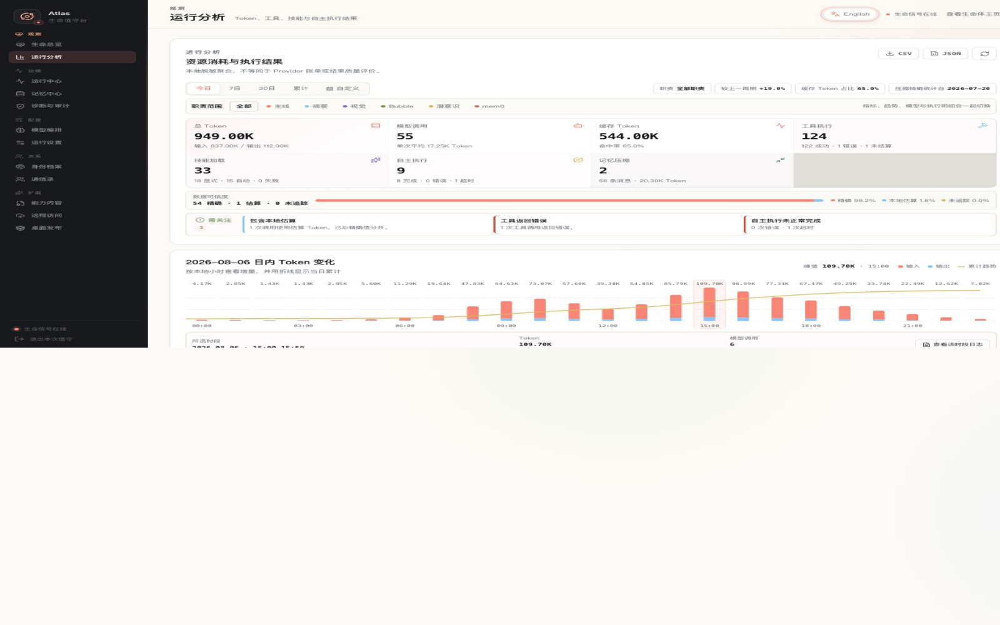
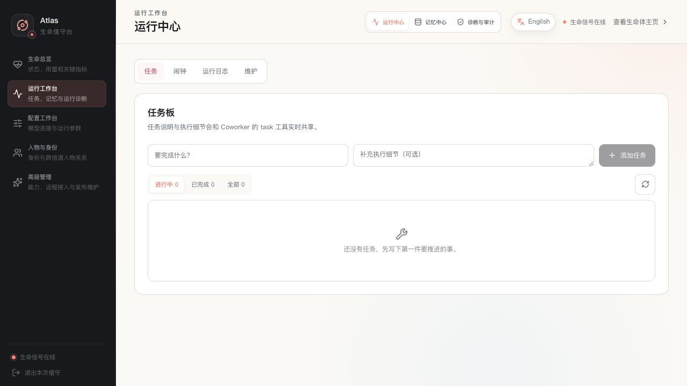

# Web 管理后台

中文 · [English](README.en.md)

[← 返回文档索引](../README.md)

Web 管理后台位于默认地址 <http://127.0.0.1:8000/admin>，用于照看 Coworker 的运行状态、
记忆、任务、模型、身份、人物关系、能力内容、远程连接和诊断记录。

如果更想从目标而不是页面结构开始，请先看[典型使用场景](use-cases.md)；创建 Skill、
Palace 或潜意识模式时使用[能力内容创作](capability-authoring.md)。

## 登录与安全边界

使用启动终端显示的管理员令牌登录。自动生成的令牌保存在
`data/admin_config.json`。管理员令牌可以读取和修改敏感配置、执行重启与恢复等操作：

- 不要提交、截图分享或发送到聊天；
- 不要让不受信任的浏览器扩展读取管理页面；
- 不要把 `/admin` 或 Coworker 的 `8000` 端口直接暴露到公网；
- Desktop 日常通信优先使用独立的 `API__COMMUNICATION_TOKEN`。

页面显示的确认名称来自当前身份。完整恢复、删除、重启等破坏性或状态改变操作会要求输入
确认名称；这是一道防误操作确认，不替代权限和备份。

## 第一次进入

尚未初始化时，后台只显示首次设置流程。完成语言、输出 Token、Provider、模型和 Passive
mode 设置后保存，Coworker 会重启。详细步骤见[首次运行](../getting-started/README.md)。

初始化完成后，管理页面按“观测、运维、配置、关系、扩展”五个
职责分组。桌面左侧会在每个分组下直接列出全部 12 个功能页；分组只帮助快速扫描，不增加
额外点击层级，任意页面都可一次点击切换。手机端使用五项底栏回到各分组最近访问的页面，
并可从顶部直接选择全部 12 个功能页。原有的 `?section=` 深链接继续有效。

生命总览 · 同屏查看当前状态、模型 Token 用量和关键运行指标。

## 观测：先看状态、用量与关键指标

### 生命总览

生命总览提供当前状态而不是完整历史：

- Agent 是活跃、休息还是等待事件；
- 今日、近 7 日和累计的模型 Token、输入、输出、缓存占比与数据可信度；
- 工具、技能与自主执行异常的关注项，以及进入完整运行分析的直接入口；
- 当前任务、闹钟、短期上下文、长期记忆和上下文容量；
- 当前模型、唤醒方式、循环次数和本轮启动时间；
- Web 身份主页可见的当前状态。

这里的用量来自当前 Coworker 进程采集的本地运行统计，不等同于 Provider 账单。若已有模型
调用但 Provider 没有返回 Token，页面会明确标注，而不会把它误报为“零用量”。

### 运行分析

“运行分析”是观测分组中的独立左侧入口，用于从摘要继续钻取。它提供：

- 今日、近 7 日、近 30 日和累计四个固定窗口，以及指定单日或起止日期的自定义范围；
- 固定窗口使用昨日、前 7 日或前 30 日作为基线，自定义范围自动比较紧邻的前一等长周期；
- 在首屏并列汇总 Token、模型调用、缓存、工具、技能加载、自主执行和记忆压缩，并紧邻显示数据可信度与关注项；
- 选择今日或自定义单日时，自动切换为 24 小时输入、输出 Token 增量与当日累计曲线；
- 点击任一小时可查看该时段的 Token、模型调用和缓存摘要，并把对应时间范围带入运行中心日志；
- 多日窗口显示最近 30 天或所选自定义范围的输入、输出 Token 日趋势；
- 精确、估算和未追踪 Token 的数据可信度拆分；
- Provider / 模型以及主线、摘要、Bubble 等职责来源；每个职责直接显示缓存率，并可通过顶部筛选或
  点击职责卡，让指标、趋势、模型、执行明细和导出同步切换到该职责；
- 工具成功、错误与未结算结果，显式技能加载与 Palace 自动加载；
- 成功记忆压缩的次数、压缩消息数、摘要模型调用与 Token，并区分自动、管理员和工具触发；点击指标可直接筛选对应压缩事件日志；
- Bubble 与潜意识的完成、错误、超时、周期和恢复等技术终态；
- 模型、工具和技能列表默认保留排序前 8 项，存在更多记录时可在原位置展开全部；
- 管理员报告 JSON 和每日汇总 CSV；使用自定义范围时，导出会携带所选区间及对应日明细。

运行分析 · 按单日或日期区间复盘资源消耗、数据可信度和执行技术结果。

公开状态页继续使用不含日明细的紧凑快照；30 天与自定义范围趋势和导出只由已认证的管理员接口提供。
统计基于本地日志，覆盖率不足时合计可能偏低；页面不会把这些数据换算成 Provider 费用。
小时图只读取隐私安全的聚合统计；联动日志仍经过原有管理员鉴权，时间范围最多 24 小时，列表使用
截断预览，完整详情只在点击后按需读取。

记忆压缩从升级后开始通过独立的成功事件精确记录。消息不足、并发跳过或摘要期间上下文发生变化而
中止的尝试不会计入压缩次数；升级前的历史日志也不会用普通 `summary_llm_response` 调用倒推，因为
Summary 模型还用于 Bubble、回溯、记忆树合并等其他职责。页面会显示压缩精确统计的起始日期。

`pending` 任务经常表示正在等待消息或定时器，并不自动等同于卡死。判断故障时应结合
“诊断与审计”、日志和最近一次成功活动。

## 运维：照看进行中的工作

运维 · 从分组左侧导航直接切换任务、记忆和诊断。

### 记忆中心

记忆中心分为：

- **记忆脊柱**：按时间尺度压缩的短期上下文树；
- **当前消息尾部**：下一次主线思考会直接看到的近期消息；
- **固定上下文**：压缩后仍需持续注入的关键信息；
- **长期记忆**：可搜索、修改和删除的 mem0 记忆；
- **并行思考记录**：已落盘的 Bubble 和潜意识轨迹；
- **记忆维护**：全量压缩与从持久日志回溯重建。

全量压缩会调用模型并改变短期上下文结构；回溯在后台运行。执行前确认模型可用，执行期间
不要同时运行离线回溯命令。删除长期记忆不可通过普通页面撤销，先确认它不再需要。

固定上下文适合少量、稳定且必须持续可见的信息。不要把大段原始资料全部固定，否则会长期
占用上下文。

### 运行中心

运行中心集中：

- 任务板；
- 闹钟与守候；
- 可按序列号或最长 24 小时时间范围筛选的生命全史交互日志；
- 应急备份；
- 安全重启。

任务和闹钟与 Coworker 的模型工具共享同一份数据。在页面修改后，Agent 下一次读取会看到
相同结果。

应急备份主要用于 Agent 连续错误后的短期上下文恢复：

- **摘要恢复**：将备份压缩后送入 inbox，Token 成本较低，不替换当前上下文；
- **完整恢复**：用备份替换当前短期上下文，影响更大，需要明确确认。

它们不同于整个 `data/`、`.coworker/` 或 Docker 卷的灾难备份。完整恢复前先记录当前状态，
优先尝试摘要恢复。

### 诊断与审计

“事件循环诊断”展示后台任务当前状态和最近错误；“管理员操作时间线”记录管理操作元数据，
不记录令牌、密钥或完整正文。

“消息流量”页签展示最近 500 条信道收发元数据，只在打开该页签时每 5 秒刷新。可以按入站/
出站、结果状态，以及信道、participant 或来源文本筛选。每条记录包含时间、信道、规范
participant ID、结果、来源和简短原因，不包含消息正文、附件内容或凭据。一次被拒绝的入站
消息通常会同时留下“入站已拒绝”和“拒绝通知已发送/发送失败”两条记录，便于区分策略判定
和通知投递结果。

消息流量不是完整对话审计；participant ID 仍可能是敏感元数据。持久化位置、轮转规则和
排障用法见[可观测性与日常运维](../operations/observability.md)，各状态的产生时机见
[信道访问列表](../channels/api-and-channels.md#信道访问列表)。

排障时：

1. 记录问题发生时间；
2. 查看对应后台任务是否持续失败；
3. 对照生命全史日志和进程日志；
4. 检查最近管理员操作是否改变配置；
5. 只在确认原因后重启或恢复。

统一检查顺序和常见问题见[故障排查](../operations/troubleshooting.md)。

## 配置：调整模型和运行参数

### 模型编排

这里管理：

- 主线模型；
- 摘要与压缩模型；
- 视觉模型；
- 失败降级链。

切换主线模型会对后续调用生效，不会中断正在执行的单次调用。摘要和视觉模型可以使用不同
Provider。修改 fallback 时按从上到下的接棒顺序填写，避免把已失效的 Provider 放在链中。

首次真实调用可能产生费用，也可能暴露模型或网关能力不兼容。更改前确认 Provider 的数据
边界、模型工具调用能力和成本。

### 运行设置

运行设置按配置域组织模型连接、记忆、Agent、API、Channel 和其他运行参数。页面会：

- 隐去已有密钥，只显示是否已经配置；
- 标记校验错误；
- 说明保存后是热更新还是需要重启；
- 对部分 Channel 提供独立管理面板。

#### 信道访问

在“配置 → 运行设置 → 信道访问”中，可以按规范 participant 地址配置每个信道的入站和
出站允许/拒绝规则。`stream`、`desktop`、`wecom` 和 `weixin` 始终显示在信道选择器中，
扩展 Channel 可以按注册名添加。

所有信道使用统一默认语义：`inbound_allow`、`inbound_deny`、`outbound_allow` 和
`outbound_deny` 四个列表都为空，表示该信道不受限制。切换信道不会自动填入
`wecom:single:...` 一类示例，也不会继承另一个信道的值。拒绝列表优先；允许列表非空时，
只有匹配完整 participant ID 的项才允许通过。保存后规则立即热更新。

这里控制的是通信地址，不识别真实人员，也不决定谁可以唤醒 Agent。完整匹配语法、拒绝
响应和日志行为见[信道访问列表](../channels/api-and-channels.md#信道访问列表)。

不要用 development mode 代替正确的 HTTPS 或 Relay 配置。完整环境变量语义见
[配置与模型](../operations/configuration.md)。

## 关系：维护搭档身份和关系

### 身份档案

身份档案维护姓名、现居地和人格。保存后会写入身份文件并刷新 System Prompt 缓存，后续
推理立即使用新身份。

同页的 System Prompt 模板编辑器可以重排或省略只读的内置分段变量，也可以添加任意自定义
正文。快捷预设支持恢复标准模板、在标准模板后添加可编辑的 `[CUSTOM]` 示例段，或完全替换
内置 Prompt；`[CUSTOM]` 只是普通标题，可以改名、拆分或删除。变量必须独占一行且最多出现
一次。模板保存到管理覆盖层后不会热更新，状态区会明确区分当前运行 Prompt 和等待安全重启
的期望模板；“恢复继承”会回到 `.env` 等启动配置，保存标准空值则明确使用产品标准模板。

“当前 System Prompt”仍是只读的实际缓存版本，不包含工具 schema、短期上下文或本轮消息。
它适合验证身份和系统配置是否已经进入提示词，不应当作完整请求审计。完全替换会移除模板
没有引用的 Identity、语言策略、Skill、Palace 和 Channel 指引，保存前应确认这是预期行为。

### 通信录

通信录把同一真人在不同信道中的地址绑定为一个人物关系。可以新建、改名、合并人物，查看
画像框架并维护个性化备注。合并前应核对双方地址；删除人物会移除关系记录，不能从普通页面
撤销。

## 扩展：管理能力、远程入口与发布

### 能力内容

能力内容管理：

- **Skill**：可调用的工作方法与流程；
- **Palace**：按情境挂载的领域知识入口；
- **潜意识模式**：后台触发的观察和思考方式。

编辑器会维护每种资产的主 Markdown 文件及附属文件。中文和英文 prose 使用 companion
文件；稳定元数据和工具名不要翻译。删除资产前检查是否仍被 Prompt、其他资产或日常流程
引用。

来自网页、消息或第三方资料的内容应先审阅再写入这些资产。Skill 与 Palace 会进入模型
上下文，恶意指令可能成为持久提示注入。

### 远程访问

远程访问用于把当前 Coworker 与自托管 Relay 配对。页面可以配置 Relay、测试连接、重连和
轮换 token。日常断线会自动重试，不需要频繁点击重连。

Relay 只解决 Desktop 的安全远程入口，不是通用反向代理。部署、备份、封禁和信任边界见
[自托管 Relay](../operations/relay.md)。

### 桌面发布

桌面发布是发布维护者功能，用于：

- 创建本地版本草稿；
- 上传 updater、installer 和签名；
- 从兼容的 GitHub Release 源同步草稿；
- 检查平台覆盖和桌面版本分布；
- 发布或回滚 `latest.json`。

创建或同步草稿不会通知客户端。只有明确 Publish 后才改变更新清单；在线推送也只是要求
客户端检查签名更新，不会绕过用户确认安装。普通使用者不需要操作此页面。

## 日常检查建议

- 确认运行状态与预期一致；
- 检查是否有持续失败的后台任务；
- 检查当前模型、fallback 和用量异常；
- 收紧信道规则后，检查消息流量中是否出现意外拒绝或通知投递失败；
- 查看任务、闹钟和近期交互是否仍需要；
- 定期验证备份能恢复，而不只确认备份文件存在；
- 在升级或更改 Provider、记忆模型、Relay 前先记录当前配置与版本。

[← 返回项目首页](../../README.md)
