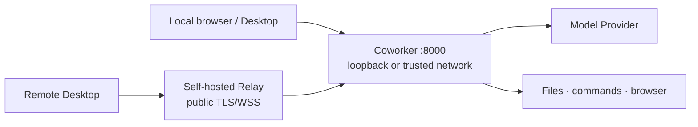

# Long-running Deployment

[中文](deployment.md) · English

[← Back to Configuration and Operations](README.en.md)

Coworker v0.x is designed for a single machine or a trusted small team, not as a public
multi-tenant service. The default topology keeps the API on a loopback address; public-internet
Desktop access goes through Relay instead of a published port `8000`.



## Choose a runtime

| Method | Best for | Operator responsibility |
|---|---|---|
| Docker Compose plus the current checkout | Long-running single-host service with source maintained in the image environment | Checkout, volumes, image versions, and host backups |
| Source plus a process manager | Development or direct checkout maintenance | Python environment, working directory, and process permissions |
| Dev Container | Development and validation | Not an unattended production service |

## Docker Compose plus the current checkout

After cloning the repository, the usual setup uses the published image as the execution environment
and mounts the current checkout as both the running source and the Agent workspace. The checked-in
`docker-compose.yaml`:

- binds the host port to `127.0.0.1:8000`;
- uses `restart: unless-stopped`;
- requests `/status` every 30 seconds for health;
- keeps runtime state and the model cache in separate named volumes;
- uses the published `offline` image to supply Linux, Python, browser dependencies, and a
  preloaded embedding model.

```bash
git clone https://github.com/VirtualBeingsResearch/CoWorker.git
cd CoWorker
docker compose up --pull always --no-build -d
docker compose ps
docker compose logs --tail 100 coworker
```

On the first start, if `data/` in the checkout is a non-empty directory left by a source run, the
entrypoint refuses to overwrite it; transfer it into the `coworker-state` volume first via
[Upgrading and Migration](upgrading.en.md#migrate-an-existing-checkout-data-directory).

Restart the container after source changes. Rebuild the execution environment only after changing
`pyproject.toml`, `uv.lock`, or image-level system dependencies; see
[Develop with the offline image](../development/development.en.md#develop-with-the-offline-image).
The usual practice is to restrict `.env` to the runtime account. A long-running deployment may keep
using the default `offline` release tag. Deployments that require reproducible upgrades or an exact
rollback target pin `COWORKER_IMAGE` to a version tag or digest and retain the pre-upgrade data
backup.

## Source process management

Source deployments typically use a dedicated low-privilege account and a fixed working directory.
A process manager needs to set:

- `WorkingDirectory` to the Coworker checkout;
- the command to `uv run coworker` in that environment;
- restart only after abnormal exits, avoiding a fast loop around configuration failures;
- secrets through a permission-restricted file or operating-system secret service;
- enough shutdown time for the final short-term snapshot and graceful exit.

The process needs neither root nor file access beyond the intended workspace. Run
`uv run coworker --check` manually before handing the process to systemd, launchd, or another manager.

## Network and remote access

- The default `API__HOST=127.0.0.1`. A container may listen on `0.0.0.0` internally while the host mapping remains loopback-only.
- For a trusted-network reverse proxy, TLS terminates at the proxy layer; `API__CORS_ORIGINS` is an
  exact list, `API__COMMUNICATION_TOKEN` a strong random value, and source networks are restricted.
  `API__PUBLIC_URL` is the browser-facing public origin, so setup and restart return through the
  proxy instead of an internal bind port.
- Public Desktop access goes through [Self-hosted Relay](relay.en.md). Relay is not a general HTTP/TCP proxy.

## Health, logs, and capacity

`/status` reports process and Agent state. Once an administrator configures a communication
token, requests without one return only basic lifecycle information. Diagnostics and Audit shows
background tasks that fail repeatedly. See
[Observability and Routine Operations](observability.en.md).

Capacity depends primarily on:

- growth of `data/logs`, attachments, inbox/outbox, and Desktop release assets;
- long-term memory and the embedding-model cache;
- peak browser, video-analysis, and parallel-Bubble memory;
- model call rate, tokens, and external Provider limits.

The usual practice is to monitor and back up workspace and state storage independently; log
rotation deletes old logs, which may include interaction history still needed for memory-tree
backfill.

## Go-live checklist

- [ ] A dedicated low-privilege account runs Coworker.
- [ ] The API is not published directly to the internet.
- [ ] Administrator and communication tokens are separate and protected.
- [ ] Trusted CORS, TLS, or Relay is configured.
- [ ] Workspace, state, and external components are included in backups.
- [ ] `/status`, a test message, and safe restart have been verified.
- [ ] Versions, image/commit, volume names, and recovery steps are recorded.
- [ ] [Data and Trust Boundaries](../architecture/data-boundaries.en.md) and the
      [Security Policy](../../SECURITY.en.md) have been reviewed.

[← Back to project home](../../README.en.md)
