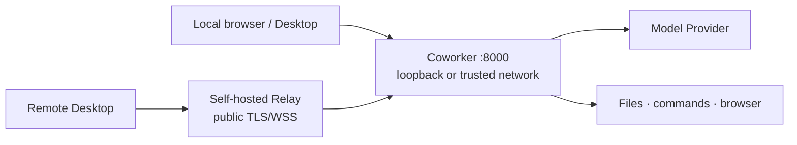

# Long-running Deployment

[中文](deployment.md) · English

[← Back to Configuration and Operations](README.en.md)

Coworker v0.x is designed for a single machine or a trusted small team, not as a public
multi-tenant service. Keep the API on a loopback address. Use Relay for public-internet Desktop
access instead of publishing port `8000`.



## Choose a runtime

| Method | Best for | Operator responsibility |
|---|---|---|
| Docker Compose | Long-running single-host service and dependency isolation | Volumes, image versions, and host backups |
| Source plus a process manager | Development or direct checkout maintenance | Python environment, working directory, and process permissions |
| Dev Container | Development and validation | Not an unattended production service |

## Docker Compose

The checked-in `docker-compose.yaml`:

- binds the host port to `127.0.0.1:8000`;
- uses `restart: unless-stopped`;
- requests `/status` every 30 seconds for health;
- separates workspace, runtime state, and model cache volumes;
- builds the strict-offline image with a preloaded embedding model by default.

```bash
git clone https://github.com/VirtualBeingsResearch/CoWorker.git
cd CoWorker
docker compose up --build -d
docker compose ps
docker compose logs --tail 100 coworker
```

Restrict `.env` to the runtime account. Pin `COWORKER_IMAGE` or the build commit. Follow
[Upgrading and Migration](upgrading.en.md) before upgrades instead of relying on an
irreproducible `latest` state.

## Source process management

Use a dedicated low-privilege account and a fixed working directory. A process manager should set:

- `WorkingDirectory` to the Coworker checkout;
- the command to `uv run coworker` in that environment;
- restart only after abnormal exits, avoiding a fast loop around configuration failures;
- secrets through a permission-restricted file or operating-system secret service;
- enough shutdown time for the final short-term snapshot and graceful exit.

Do not run as root or grant file access beyond the intended workspace. Run
`uv run coworker --check` manually before handing the process to systemd, launchd, or another manager.

## Network and remote access

- Keep `API__HOST=127.0.0.1`. A container may listen on `0.0.0.0` internally while the host mapping remains loopback-only.
- For a trusted-network reverse proxy, terminate TLS there, set exact `API__CORS_ORIGINS`, use a
  strong `API__COMMUNICATION_TOKEN`, and restrict source networks.
- `API__DEVELOPMENT_MODE=true` disables some Desktop Bearer and HTTPS checks. Use it only for
  deliberate local development.
- For public Desktop access, deploy [Self-hosted Relay](relay.en.md). Relay is not a general HTTP/TCP proxy.

## Health, logs, and capacity

Use `/status` for process and Agent state. Use Diagnostics and Audit to find background tasks that
fail repeatedly. See [Observability and Routine Operations](observability.en.md).

Capacity depends primarily on:

- growth of `data/logs`, attachments, inbox/outbox, and Desktop release assets;
- long-term memory and the embedding-model cache;
- peak browser, video-analysis, and parallel-Bubble memory;
- model call rate, tokens, and external Provider limits.

Monitor and back up workspace and state storage independently. Before rotating logs, confirm that
you are not deleting interaction history still needed for memory-tree backfill.

## Go-live checklist

- [ ] A dedicated low-privilege account runs Coworker.
- [ ] The API is not published directly to the internet.
- [ ] Administrator and communication tokens are separate and protected.
- [ ] Trusted CORS, TLS, or Relay is configured.
- [ ] Workspace, state, and external components are included in backups.
- [ ] `/status`, a test message, and safe restart have been verified.
- [ ] Versions, image/commit, volume names, and recovery steps are recorded.
- [ ] [Data and Trust Boundaries](../architecture/data-boundaries.en.md) and the
      [Security Policy](../../SECURITY.en.md) have been reviewed.

[← Back to project home](../../README.en.md)
