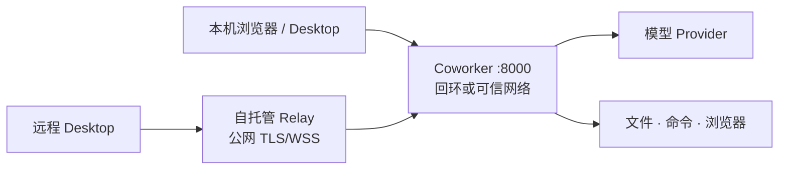

# 长期运行与部署

中文 · [English](deployment.en.md)

[← 返回配置与运维](README.md)

Coworker v0.x 适合单机或可信小团队环境，不是公网多租户服务。默认拓扑应让 API 只监听
回环地址；公网 Desktop 使用 Relay，而不是直接公开 `8000` 端口。



## 选择运行方式

| 方式 | 适合 | 责任 |
|---|---|---|
| Docker Compose + 当前 checkout | 长期单机运行、在镜像执行环境中维护源码 | 管理 checkout、卷、镜像版本和宿主机备份 |
| 源码 + 进程管理器 | 开发或需要直接维护 checkout | 管理 Python 环境、工作目录和进程权限 |
| Dev Container | 开发与验证 | 不作为无人值守生产服务 |

## Docker Compose + 当前 checkout

已经克隆仓库时，推荐把发布镜像作为执行环境，将当前 checkout 挂载为实际运行的源码与
Agent 工作区。仓库内 `docker-compose.yaml` 会：

- 将宿主机端口绑定到 `127.0.0.1:8000`；
- 使用 `restart: unless-stopped`；
- 每 30 秒请求 `/status` 进行健康检查；
- 将运行状态和模型缓存保存在独立命名卷中；
- 使用预置 embedding 模型的 `offline` 发布镜像提供 Linux、Python 和浏览器依赖。

```bash
git clone https://github.com/VirtualBeingsResearch/CoWorker.git
cd CoWorker
docker compose up --pull always --no-build -d
docker compose ps
docker compose logs --tail 100 coworker
```

首次启动前检查 checkout 中的 `data/`。如果它是源码运行留下的非空目录，
入口脚本会拒绝覆盖；先按[升级与迁移](upgrading.md#迁移-checkout-中现有的-data)
将其转移到 `coworker-state` 卷。

源码修改后重启容器即可。只有修改 `pyproject.toml`、`uv.lock` 或镜像中的系统依赖时，
才需要按[开发指南](../development/development.md#使用-offline-镜像开发)重建执行环境。
将 `.env` 权限限制为运行账户可读。长期运行可继续使用默认的 `offline`
发布标签；如果部署要求可重现升级或精确回滚，再将 `COWORKER_IMAGE` 固定到版本标签或
digest，并保留升级前的数据备份。

## 源码进程管理

使用专用低权限系统账户和固定工作目录。进程管理器至少需要设置：

- `WorkingDirectory` 为 Coworker checkout；
- 启动命令为该目录环境中的 `uv run coworker`；
- `Restart` 仅在异常退出时生效，避免配置错误形成高速重启循环；
- 环境和密钥来自权限受控的文件或系统密钥服务；
- 停止时给进程时间保存短期快照并优雅退出。

不要以 root 运行，也不要授予超出工作区的文件权限。先手动执行
`uv run coworker --check`，再交给 systemd、launchd 或其他管理器。

## 网络与远程访问

- 保持 `API__HOST=127.0.0.1`；容器内部可监听 `0.0.0.0`，但宿主机映射仍应限制到回环。
- 若在可信内网前置反向代理，代理层终止 TLS，设置精确的 `API__CORS_ORIGINS` 和强
  `API__COMMUNICATION_TOKEN`，并限制来源网络。将 `API__PUBLIC_URL` 设为浏览器实际访问
  的公开 origin，使初始化和重启始终返回反向代理地址，而不是内部监听端口。
- 公网 Desktop 按[自托管 Relay](relay.md)部署。Relay 不是通用 HTTP/TCP 代理。

## 健康、日志与容量

使用 `/status` 判断进程和 Agent 状态；管理员配置通信令牌后，未携带令牌时它只返回基础生命周期
信息。使用管理后台“诊断与审计”判断后台任务是否持续失败。完整观测方法见
[可观测性与日常运维](observability.md)。

容量没有统一固定值，主要由以下因素决定：

- `data/logs`、附件、收发件箱和 Desktop 更新制品的增长；
- 长期记忆数据库和 embedding 模型缓存；
- 浏览器、视频分析和并行 Bubble 的峰值内存；
- 模型调用速率、Token 和外部 Provider 限制。

为工作区和状态卷设置磁盘监控与独立备份。日志轮转前确认不会删除仍需回溯记忆树的原始
交互日志。

## 上线检查

- [ ] 使用专用低权限账户；
- [ ] API 未直接暴露公网；
- [ ] 管理员令牌与通信令牌分离并安全保存；
- [ ] 配置了可信 CORS、TLS 或 Relay；
- [ ] 工作区、状态和外部组件已纳入备份；
- [ ] `/status`、测试消息和安全重启已验证；
- [ ] 记录了版本、镜像/提交、卷名和恢复步骤；
- [ ] 阅读[数据与信任边界](../architecture/data-boundaries.md)与[安全策略](../../SECURITY.md)。

[← 返回项目首页](../../README.md)
